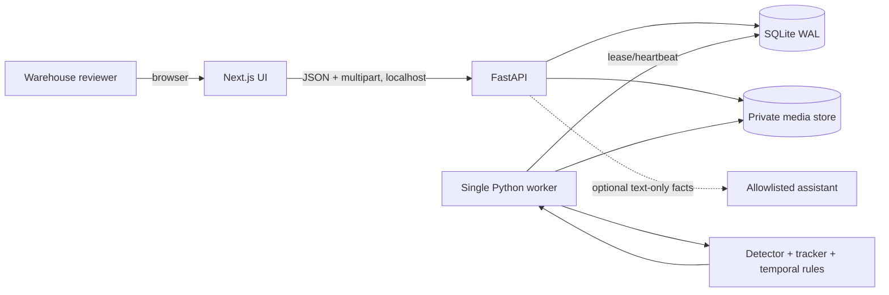

# Warehouse Handling Video Intelligence — Implementation Blueprint

**Document status:** Authoritative build plan for the six-day prototype  
**Version:** 1.0  
**Date:** 2026-09-03  
**Build window:** five implementation days plus one security, test, and polish day  
**Target submission:** 2026-09-10  

---

## 1. How to read this document

This file converts the challenge brief, the revised architecture review, and the council review into one executable specification. It is the team's source of truth. If a chat, slide, whiteboard, or code comment conflicts with this file, this file wins until all three team members record an amendment in the decision log.

Normative terms have precise meanings:

- **MUST / MUST NOT:** release-blocking requirement.
- **SHOULD / SHOULD NOT:** follow unless the owner records a reason in `docs/decisions.md`.
- **MAY:** optional and outside the critical path.
- Values labelled **seed threshold** are the exact initial implementation values. They may be changed only by the calibration procedure in Section 12, with the resulting configuration version recorded in every run manifest.

### 1.1 Challenge requirements versus team decisions

The attached challenge document supplies the problem and submission constraints; it does not dictate this implementation. The following are treated as challenge requirements:

- Analyze warehouse-handling video for behavior associated with product-damage risk.
- Demonstrate at least 10 predefined behaviors/scenarios; the brief also refers to a smaller 4–5 behavior/scenario scope elsewhere.
- Provide a concise 5–6 slide deck and a short demo covering 3–5 scenarios.
- Address privacy, consent, access, storage, retention, false positives, explainability, and human review.
- Submit by 2026-09-10.

Everything else in this blueprint is a team design decision made to satisfy those requirements reliably within six days.

### 1.2 Binding assumptions

Unless replaced at the Day 1 gate, the team will build against these assumptions:

1. Input is a prerecorded MP4 from one fixed or nearly fixed warehouse camera.
2. A clip is at most 10 minutes, 500 MiB (`524288000` bytes), 3840×2160, and 60 FPS before normalization.
3. The demonstrator runs on one Windows or Linux workstation. A CUDA GPU is preferred but not required.
4. The prototype is single-tenant and bound to `127.0.0.1`; it is not an internet-facing service.
5. Videos used for development and demonstration are owned by the team, explicitly licensed, or staged with consenting participants.
6. The system estimates **handling-risk evidence**, not actual product damage, employee intent, blame, or disciplinary outcomes.
7. The source repository will be publicly released under AGPL-3.0 if Ultralytics code or models are used without an enterprise licence. If that is unacceptable, the model backend must be changed before Day 1 ends.

---

## 2. Product definition and success criteria

### 2.1 One-sentence product

Upload a warehouse-handling video and receive reviewable, time-coded handling-risk events with an evidence clip, deterministic rationale, confidence/evidence-quality indicators, and a human confirmation workflow.

### 2.2 What makes this prototype technically distinctive

The differentiator is not the number of model calls. It is a **proof-carrying event**: every alert includes the temporal track, measured predicates, rule and model versions, risk calculation, source hash, and reproducible evidence window that produced it.

The system stands out through five focused capabilities:

1. **Temporal verification:** it distinguishes a genuine release–motion–impact sequence from a single suspicious frame.
2. **Candidate-to-verifier cascade:** inexpensive first-pass inference proposes a narrow time window; optional high-rate verification reprocesses only that window.
3. **Configuration-driven, explainable rules:** the event reason is generated from evaluated predicates, never invented by a language model.
4. **Reproducible evidence manifests:** another operator can replay the same source, model, config, and code revision and compare the output.
5. **Honest human-in-the-loop semantics:** reviewers confirm or reject a handling-risk event; they do not “confirm damage” unless an independent inspection provides that fact.

### 2.3 Prototype success definition

The prototype is complete only when all of the following are true:

- A fresh install can ingest a valid MP4, create a durable job, process it, show progress, create events, stream evidence media, accept a review, and display an aggregate summary.
- The hero behavior meets the event-level quality gate in Section 17 on the locked validation set.
- Ten named scenarios are represented, with expected results documented before evaluation.
- At least three scenarios are demonstrated end to end from live upload or a clearly labelled live run.
- Replay mode, if used, is visibly labelled and backed by an artifact generated by the same production pipeline.
- No release-blocking security, privacy, licensing, or reproducibility issue remains after Day 6.

### 2.4 Explicit non-goals for this build

The team MUST NOT put the following on the six-day critical path:

- Multi-camera identity matching or real-time CCTV ingestion.
- Kubernetes, cloud microservices, Redis, Kafka, Celery, or distributed inference.
- A general-purpose scene-graph platform or rule-authoring DSL.
- Automatic model retraining, active learning, or MLOps orchestration.
- Warehouse-management-system integration.
- Worker recognition, face recognition, emotion inference, worker scoring, or punitive automation.
- Claims of measured height, force, mass, damage, or financial loss without calibrated sensors and validation.
- A free-form SQL/LLM agent or sending raw video to a third-party language model.
- Production authentication, multi-tenancy, or public-internet deployment.

---

## 3. Scope: one hero behavior, two supporting behaviors, ten scenarios

### 3.1 Behavior engines

| ID | Engine | Priority | Output |
|---|---|---:|---|
| `DROP_OR_FORCEFUL_RELEASE` | Temporal release, rapid motion, impact, and settle sequence | P0 hero | `DROP` or `FORCEFUL_RELEASE` event |
| `DRAGGING` | Package moves horizontally along the floor while associated with a person and not supported by equipment | P0 simple | `DRAGGING` event |
| `PLACEMENT_VIOLATION` | Package remains in a prohibited zone or extends beyond a calibrated visible support surface | P0 simple | `PROHIBITED_ZONE` or `VISIBLE_SUPPORT_OVERHANG` event |
| `STANDING_ON_PRODUCT` | Person-foot/product overlap with dwell | P1 only after Day 3 gate | Not promised for submission |

The team MUST describe this as **three behavior engines covering ten predefined scenarios**, not as ten independently trained behaviors.

There is a wording risk in the source brief: an evaluator could interpret “4/5 behaviours or scenarios” as requiring four distinct risky-event families rather than four or five demonstrations. Member 3 MUST request written organizer confirmation by Day 1 12:00. The default build remains the council-approved three-engine scope. If the organizer explicitly requires four distinct families, `STANDING_ON_PRODUCT` becomes P0 only after the Day 2 vertical slice passes; it uses a pose adapter and foot/package dwell rule, and an existing supporting engine may be reduced rather than delaying the hero path. The team MUST NOT silently relabel variants as independent models.

### 3.2 Locked scenario catalogue

The expected result is committed before tuning. “No event” clips are first-class controls.

| Scenario | Setup | Expected output | Demo priority |
|---|---|---|---:|
| `S01_CONTROLLED_PLACE` | Package is lowered gently onto a pallet | No risk event | High |
| `S02_LOW_DROP` | Package is released with a short downward travel | `DROP`, medium risk | High |
| `S03_HIGH_DROP` | Package is released with a larger downward travel and rapid impact | `DROP`, high or critical risk | High |
| `S04_LATERAL_THROW` | Package is released with strong lateral motion before impact | `FORCEFUL_RELEASE`, high or critical risk | High |
| `S05_SUPPORTED_TRANSPORT` | Package moves on material-handling equipment or is carried steadily | No dragging event | Medium |
| `S06_SHORT_DRAG` | Package slides along the floor for at least 0.8 but less than 2.0 seconds | `DRAGGING`, medium risk | Medium |
| `S07_PROLONGED_DRAG` | Package slides along the floor for at least 2.0 seconds | `DRAGGING`, high risk | High |
| `S08_CORRECT_PALLET_PLACE` | At least 80% of the visible contact footprint overlaps a calibrated support polygon and the package is in an allowed zone | No placement event | Medium |
| `S09_PALLET_OVERHANG` | More than 20% of the visible contact footprint remains outside a calibrated support polygon for at least 0.5 seconds | `VISIBLE_SUPPORT_OVERHANG` | High |
| `S10_PROHIBITED_ZONE` | Package is stationary in a marked prohibited polygon for at least 1.0 second | `PROHIBITED_ZONE` | High |

Ten source clips are the minimum. The target dataset is 30 clips: three takes per scenario, with varied package color, operator, direction, and lighting. No training frame may appear in the validation or demonstration partition.

---

## 4. Architecture decision

### 4.1 Deployment shape

The prototype is a modular monolith with three local processes:

1. **Web:** Next.js user interface on port `3000`.
2. **API:** FastAPI HTTP process on port `8000`.
3. **Worker:** one Python process that leases jobs from SQLite and performs video processing.

The API and worker import the same Python package and share one SQLite database plus one private filesystem root. This is not a microservice architecture. The separate worker exists because CPU/GPU video work must not block the HTTP event loop or die with a request. FastAPI itself cautions that heavy background computation is better handled outside in-process background tasks.

### 4.2 System context



### 4.3 Processing sequence

```mermaid
sequenceDiagram
    actor U as Reviewer
    participant W as Web UI
    participant A as FastAPI
    participant D as SQLite
    participant Q as Worker
    participant V as Vision pipeline
    participant S as Media store

    U->>W: Select MP4 and camera profile
    W->>A: POST /api/v1/videos
    A->>A: Stream, hash, probe, validate
    A->>S: Atomic commit source.mp4
    A->>D: Insert video
    A-->>W: 201 Video
    W->>A: POST /api/v1/runs
    A->>D: Insert run + queued job atomically
    A-->>W: 202 RunAccepted
    loop until terminal
        W->>A: GET /api/v1/jobs/{job_id}
        A-->>W: state, stage, progress
    end
    Q->>D: Atomically lease oldest eligible job
    Q->>V: Normalize then first-pass detect/track
    V->>V: Build track observations and candidates
    V->>V: Optional targeted verification
    V->>V: Deterministic rules and risk policy
    V->>S: Evidence clips, thumbnails, manifest
    Q->>D: Insert events; mark run/job succeeded
    W->>A: GET run and events
    A-->>W: Evidence and decision traces
    U->>W: Confirm, reject, or mark uncertain
    W->>A: POST /events/{event_id}/reviews
```

### 4.4 Component boundaries

| Component | Owns | Must not own |
|---|---|---|
| Web | Upload UX, job polling, calibration editor, event timeline, evidence player, review actions, analytics rendering | Detection rules, risk calculations, filesystem paths |
| API | Validation, request/response contracts, transactions, media authorization, range responses, summaries | Long-running inference, generated risk explanations |
| Worker | Job lease, video normalization, pipeline invocation, artifacts, atomic completion/failure | HTTP response lifecycle, UI formatting |
| Vision adapter | Frames → typed detections and tracks | Business risk, persistence, HTTP |
| Rule engine | Typed observations → candidates/events and decision traces | Model loading, SQL, prose generation |
| Risk policy | Event facts → score, tier, factor list | Model confidence or employee judgement |
| Evidence writer | Source intervals + overlays → media and manifest | Event detection decisions |
| Repository layer | All SQL and transactions | CV algorithms |

---

## 5. Technology stack

### 5.1 Approved baseline

| Layer | Selection | Constraint and rationale |
|---|---|---|
| Runtime | Python `3.11.x` | Broad PyTorch/OpenCV compatibility; exact patch captured in `.python-version` |
| API | FastAPI + Uvicorn | Typed HTTP/OpenAPI contracts; API uses one process for this prototype |
| Schemas/settings | Pydantic 2 + `pydantic-settings` | Single source for runtime validation and OpenAPI |
| Persistence | SQLAlchemy 2 + Alembic + SQLite 3 | Durable local transactions and explicit migrations |
| CV | PyTorch, PyAV, OpenCV headless, NumPy | PTS-correct decoding, frame processing, geometry, and model runtime |
| Detection | Ultralytics YOLO26n custom detector, behind `Detector` protocol | Small baseline; replaceable if licence or accuracy gate fails |
| Tracking | ByteTrack for fixed camera | Lowest-complexity baseline; moving camera is rejected rather than silently mishandled |
| Media | System FFmpeg and ffprobe | Normalization, evidence clipping, probing; invoked by argument array, never a shell string |
| Web | Node.js `22.x` LTS, pnpm, Next.js 16 App Router, React 19, TypeScript strict | Thin local review UI; Next.js 16 supports Node 20.9+ |
| Styling/UI | Tailwind CSS 4, native accessible controls, Recharts | Minimal dependencies and rapid dashboard work |
| Python quality | Ruff, mypy, pytest, pytest-cov, httpx | Lint, types, unit/integration API tests |
| Web quality | ESLint flat config, Vitest, Testing Library, Playwright | Component and end-to-end tests |
| Security | pip-audit, pnpm audit, Bandit, Semgrep community rules, Gitleaks | Day 6 dependency, source, and secret checks |
| CI | GitHub Actions on Windows or Ubuntu with CPU replay fixtures | Reproducible lint/type/test/build gate |

All direct dependencies MUST be exact-pinned in `requirements.lock` and `pnpm-lock.yaml` by 12:00 on Day 1. `.python-version`, `.nvmrc`, the `package.json` `engines` field, and its `packageManager` field pin the selected Python patch, Node patch, and pnpm version. “Latest” MUST NOT appear in CI, Dockerfiles, or setup scripts. Model weights and FFmpeg binaries MUST be versioned by checksum in `THIRD_PARTY.md`, even if they are not committed.

### 5.2 Licensing gate

Ultralytics states that AGPL-3.0 is appropriate when the complete project is open-sourced and that proprietary use requires an enterprise licence. Before writing model-specific code, Member 2 records one of these decisions in `THIRD_PARTY.md`:

- `AGPL_OPEN_SOURCE`: the complete corresponding source and required model/config artifacts will be published under compatible terms; or
- `ENTERPRISE_LICENSE`: evidence of the licence owner and scope is recorded; or
- `ALTERNATIVE_BACKEND`: Ultralytics is removed and the `Detector` protocol is implemented with an approved alternative.

No ambiguous “demo-only” exception is assumed.

### 5.3 Model-backend contract

```python
from dataclasses import dataclass
from pathlib import Path
from typing import Iterable, Protocol, Sequence

@dataclass(frozen=True)
class Frame:
    index: int
    timestamp_ms: int
    bgr: "NDArray[uint8]"

@dataclass(frozen=True)
class Detection:
    class_id: str                 # person|package|pallet|equipment
    confidence: float             # inclusive [0.0, 1.0]
    bbox_xyxy_norm: tuple[float, float, float, float]

@dataclass(frozen=True)
class TrackedDetection(Detection):
    track_id: int                 # unique only within one run

class DetectorTracker(Protocol):
    backend_name: str
    model_sha256: str

    def process(self, frames: Iterable[Frame]) -> Iterable[Sequence[TrackedDetection]]:
        """Yield exactly one detection sequence for every input frame, in order."""
```

No Ultralytics object is allowed outside `backend/vision/adapters/ultralytics_adapter.py`. Replay implements the same protocol from a versioned `tracks.jsonl.gz` artifact.

### 5.4 Detector data and training contract

A generic COCO checkpoint MUST NOT be presented as a warehouse-package detector. The primary `warehouse-v1.pt` checkpoint is either an already licensed domain checkpoint that passes the same gate, or a controlled fine-tune with these fixed rules:

1. Record three independent takes per scenario. Take A is training, Take B is threshold-development, and Take C is holdout; splitting occurs by original recording before frames are extracted.
2. Sample annotation frames at 2 FPS plus every decisive event boundary. Label all visible instances of `person`, `package`, `pallet`, and `equipment`; mark an object difficult/ignored when less than 25% is visible. Do not create boxes from model predictions without human correction.
3. Require at least 300 annotated frames and 100 package instances before training. If unavailable by Day 1 noon, narrow to the controlled package/camera and use an existing licensed checkpoint; do not train on the holdout.
4. Initialize from `yolo26n.pt`; use seed `42`, image size `960`, batch `8` on GPU (`2` on CPU), maximum `50` epochs, patience `10`, AdamW, initial learning rate `0.001`, weight decay `0.0005`, `degrees=0`, `translate=0.10`, `scale=0.25`, `shear=0`, `perspective=0`, `fliplr=0.50`, `mosaic=0.50`, `mixup=0`, `copy_paste=0`, `hsv_h=0.015`, `hsv_s=0.40`, and `hsv_v=0.30`. The full emitted training configuration is stored with the run. Training is a separate script and never runs when the demo application starts.
5. Select the checkpoint with the highest package visible-frame recall at IoU `0.30` on Take B subject to package precision `>=0.70`. Break ties within `0.02` recall in favor of lower target-hardware latency.
6. Hash the selected weights, class map, training configuration, split manifest, and annotation export. Record them in `docs/model_card.md` and `models/checksums.json`.
7. Freeze weights at the end of Day 1. Any later weight change invalidates prior track/event metrics and requires the complete locked evaluation to run again.

The detector gate is package visible-frame recall `>=0.80` and precision `>=0.70` on the Day 1 audit set. Failure triggers Section 19.1; replay cannot be used to claim the detector passed.

Release inference uses `config/detector.yolo26n.v1.yaml`:

```yaml
schema_version: detector-config.v1
input_size: 960
nms_iou: 0.50
maximum_detections_per_frame: 100
minimum_confidence:
  person: 0.15
  package: 0.10
  pallet: 0.15
  equipment: 0.15
gpu_batch_size: 8
cpu_batch_size: 1
precision: fp32
```

The Day 1 visible-frame detector gate uses the applicable per-class minimum above. The higher `0.45` median confidence in Section 10.1 is an event-publication gate, not a detector-recall threshold.

---

## 6. Repository structure and dependency rules

```text
ai-video-intelligence/
├─ apps/
│  └─ web/
│     ├─ app/
│     │  ├─ page.tsx
│     │  ├─ upload/page.tsx
│     │  ├─ runs/[runId]/page.tsx
│     │  ├─ events/[eventId]/page.tsx
│     │  └─ settings/camera/page.tsx
│     ├─ components/
│     ├─ lib/api.ts
│     ├─ lib/api.ts
│     ├─ lib/schema.d.ts          # generated types only; never hand-edited
│     ├─ tests/
│     ├─ package.json
│     └─ next.config.ts
├─ backend/
│  ├─ pyproject.toml
│  ├─ requirements.lock
│  ├─ alembic.ini
│  ├─ migrations/
│  ├─ src/warehouse_ai/
│  │  ├─ api/
│  │  │  ├─ app.py
│  │  │  ├─ dependencies.py
│  │  │  ├─ errors.py
│  │  │  └─ routes/{health,videos,runs,jobs,events,media,analytics}.py
│  │  ├─ worker/{main,lease,processor}.py
│  │  ├─ domain/{enums,models,risk,decision_trace}.py
│  │  ├─ vision/
│  │  │  ├─ adapters/{base,ultralytics_adapter,replay_adapter}.py
│  │  │  ├─ {frames,tracking,features,candidates,verify,pipeline}.py
│  │  │  └─ rules/{base,drop_forceful_release,dragging,placement}.py
│  │  ├─ evidence/{clips,overlay,manifest}.py
│  │  ├─ repositories/{database,videos,jobs,runs,events}.py
│  │  ├─ services/{ingest,run_service,review,analytics,retention}.py
│  │  ├─ config.py
│  │  └─ logging.py
│  └─ tests/{unit,integration,security}/
├─ config/
│  ├─ behavior_rules.v1.yaml
│  ├─ risk_policy.v1.yaml
│  ├─ detector.yolo26n.v1.yaml
│  ├─ tracker.bytetrack.v1.yaml
│  └─ camera.demo.v1.json
├─ contracts/
│  └─ openapi.json             # generated from Pydantic/FastAPI; committed
├─ data/
│  ├─ README.md
│  ├─ annotations/
│  ├─ golden/                 # tiny licensed fixtures or download manifest
│  └─ splits.v1.json
├─ models/
│  ├─ README.md               # weights are ignored; SHA-256 is recorded
│  └─ checksums.json
├─ storage/                   # runtime data; gitignored
├─ scripts/{bootstrap,dev,verify,calibrate_thresholds,purge_expired}.*
├─ docs/{decisions,annotation_guide,scenario_matrix,demo_runbook,model_card}.md
├─ .python-version
├─ .nvmrc
├─ .env.example
├─ .gitignore
├─ SECURITY.md
├─ THIRD_PARTY.md
└─ IMPLEMENTATION_BLUEPRINT.md
```

Dependency direction is enforced during review:

```text
api ──> services ──> domain <── vision/rules
                └──> repositories
worker ──> services + vision + evidence
adapters ──> vendor libraries
web ──HTTP/OpenAPI──> api
```

`domain` MUST NOT import FastAPI, SQLAlchemy, OpenCV, Ultralytics, or Next.js concepts. Route handlers MUST NOT contain SQL or CV logic. The web app MUST NOT reconstruct risk scores.

---

## 7. Runtime configuration

The API and worker read the same environment schema. Startup fails on an absent required value, an unknown enum, or an invalid numeric range.

```dotenv
APP_ENV=development                 # development|test|demo
API_HOST=127.0.0.1
API_PORT=8000
WEB_ORIGIN=http://127.0.0.1:3000
DATABASE_URL=sqlite:///./storage/app.db
STORAGE_ROOT=./storage
FFMPEG_PATH=ffmpeg                  # resolved to an absolute executable at startup
FFPROBE_PATH=ffprobe                # resolved to an absolute executable at startup
MODEL_BACKEND=ultralytics           # ultralytics|replay
MODEL_PATH=./models/warehouse-v1.pt
MODEL_DEVICE=auto                   # auto|cpu|cuda:0
INFERENCE_FPS=10
VERIFY_ENABLED=true
VERIFY_FPS=25
VERIFY_PADDING_MS=2000
MAX_UPLOAD_BYTES=524288000
MAX_VIDEO_SECONDS=600
MAX_VIDEO_WIDTH=3840
MAX_VIDEO_HEIGHT=2160
MEDIA_RETENTION_HOURS=72
RETENTION_SCAN_SECONDS=600
JOB_LEASE_SECONDS=60
JOB_HEARTBEAT_SECONDS=10
JOB_MAX_ATTEMPTS=2
LOG_LEVEL=INFO
ASSISTANT_ENABLED=false
OPENAI_API_KEY=                    # required only when assistant is enabled
OPENAI_MODEL=                      # explicitly pinned only when enabled
OPENAI_STORE=false
```

Relative paths resolve from the repository root, are converted to absolute paths at startup, and MUST remain descendants of that root. Production/demo startup refuses `API_HOST=0.0.0.0` unless `ALLOW_REMOTE_BIND=true` is explicitly set and authentication is added; remote bind is outside this prototype's default threat model.

---

## 8. Media lifecycle and filesystem contract

### 8.1 Canonical paths

The database stores media IDs and root-relative POSIX paths, never user-provided paths.

```text
storage/
├─ .staging/<upload_uuid>.part
├─ .work/<run_uuid>/<attempt>/
├─ .orphaned/uploads/<video_uuid>/
├─ .orphaned/runs/<run_uuid>/<attempt>/
├─ .deleting/<delete_operation_uuid>/
├─ videos/<video_uuid>/source.mp4
├─ runs/<run_uuid>/normalized.mp4
├─ runs/<run_uuid>/annotated.mp4
├─ runs/<run_uuid>/tracks.jsonl.gz
├─ runs/<run_uuid>/events.json
├─ runs/<run_uuid>/manifest.json
└─ runs/<run_uuid>/evidence/<event_uuid>/{clip.mp4,thumbnail.jpg,trace.json}
```

Upload writes use a same-directory temporary filename followed by an atomic rename. Run artifacts are built beneath `storage/.work/<run_uuid>/<attempt>/`, validated and fsynced, then the entire attempt directory is atomically renamed to `storage/runs/<run_uuid>` **before** the publication transaction. Until database publication, no API record points at that directory. A run becomes `SUCCEEDED` only after the database transaction commits. Failed/expired staging data and orphaned unpublished run directories are handled by startup recovery and the retention task.

### 8.2 Upload validation algorithm

`POST /videos` performs these steps in this order:

1. Reject a declared content length above `MAX_UPLOAD_BYTES` before reading the body.
2. Accept `.mp4` case-insensitively; every other extension is rejected. The stored client source keeps the `.mp4` extension and the analysis proxy is normalized separately.
3. Stream to `.staging/<server_uuid>.part` in 1 MiB chunks while enforcing the byte limit and computing SHA-256. Never use the client filename as a path.
4. Verify an ISO Base Media/MP4 signature (`ftyp` box in the expected header region). `Content-Type: video/mp4` is required but remains advisory rather than authoritative.
5. Invoke a configured absolute `ffprobe` executable with `-nostdin`, an argument list, `shell=False`, a 15-second timeout, captured stderr limited to 64 KiB, a minimal inherited environment, and the staging path after all fixed options (never as an option fragment).
6. Require an MP4-family container, H.264/AVC video, exactly one decodable video stream, zero or one audio stream, no subtitle/data/attachment streams, duration `(0, 600]` seconds, dimensions `(0, 3840]×(0, 2160]`, and frame rate `(0, 60]`. Audio is discarded during normalization.
7. Decode the first, middle, and final reachable video frames. Reject if all cannot be decoded.
8. Generate video and source-media UUIDs, create `storage/videos/<video_uuid>` with owner-only write permission, and atomically move the staging file to `source.mp4`.
9. In one database transaction insert the `videos` row and its `media_assets(kind='SOURCE')` row. Only after commit may the API return `201`.
10. On pre-rename failure, delete only the resolved staging path. On a post-rename/database failure, move only that validated video UUID directory beneath `.orphaned/uploads/<video_uuid>`; startup cleanup removes it when no video row exists. Return the problem response defined in Section 15.

This follows the OWASP file-upload principles of allowlisting, type/signature validation, server-generated names, isolated storage, permissions, and size limits.

### 8.3 Normalized media

The worker applies container rotation metadata and normalizes input to H.264 MP4, `yuv420p`, constant frame rate equal to `min(source_fps, 25)`, presentation start time zero, original display aspect ratio, maximum long edge 1920 pixels, all audio removed, and `+faststart`. PyAV decodes the normalized proxy; analysis time is `round(frame.pts × frame.time_base × 1000)` and never wall-clock time or a guessed frame index. Missing or non-monotonic proxy PTS fails the run with `FAILED_DECODE`. OpenCV may draw/transform pixels but is not the authoritative clock.

Evidence clips span `[max(0,event.start_ms-1500), min(video.duration_ms,event.end_ms+1500)]`. They include a visible timestamp, event type, track ID, and bounding-box overlay. The clean source is never overwritten.

### 8.4 Retention

- Unsuccessful staging data: purge after 1 hour.
- Source, normalized media, evidence, and run artifacts: purge 72 hours after upload by default.
- Automatic retention never removes a video with a queued/running child run; it skips that row and reevaluates `expires_at` on the next 10-minute maintenance pass, then uses the same verified deletion flow after all child runs become terminal.
- Structured aggregate counts without media: may be retained until manually deleted.
- Manual “delete video” returns `409 RUN_IN_PROGRESS` while any child run is queued/running. Otherwise it moves only the database-enumerated, root-contained video/run UUID directories under `storage/.deleting/<operation_uuid>/`, deletes rows in one transaction, and then permanently removes that quarantined operation directory. On a crash, startup recovery restores moved files when the video row still exists and finishes deletion when it does not. Sibling UUID directories are never selected by glob.
- The UI displays the expiry time and offers explicit deletion.
- The demo operator MUST obtain participant consent before capture and MUST NOT use production CCTV footage without documented authority.

---

## 9. Vision data model and coordinate conventions

All boxes are normalized relative to the decoded frame and represented as `(x1, y1, x2, y2)` with origin at the upper-left, `x` increasing right, and `y` increasing down. Each coordinate is finite and clamped to `[0,1]`; `x1 < x2` and `y1 < y2` are required.

One `TrackFrame` is serialized for every sampled inference frame, including frames with no tracks. This preserves absence and timing during replay:

```json
{
  "schema_version": "track-frame.v1",
  "frame_index": 120,
  "timestamp_ms": 4800,
  "frame_width": 1920,
  "frame_height": 1080,
  "tracks": [
    {
      "track_id": 7,
      "class_id": "package",
      "confidence": 0.87,
      "bbox_xyxy_norm": [0.31, 0.42, 0.45, 0.68],
      "is_interpolated": false
    }
  ]
}
```

`tracks.jsonl.gz` contains one canonical frame object per line in strictly increasing `(timestamp_ms, frame_index)` order; tracks within a frame are sorted by `(class_id, track_id)`. It intentionally omits `run_id` and generated time. Keys are sorted, coordinates/confidence are rounded half-up to six decimal places, each record ends with `\n`, non-finite values are forbidden, and gzip `mtime=0`; therefore identical observation inputs produce identical compressed bytes.

Only `person`, `package`, `pallet`, and `equipment` are valid class IDs for v1. Trolleys and forklifts map to `equipment`; the original detector label is retained in diagnostic metadata but is not a rule class.

### 9.1 Preprocessing and smoothing

1. Sample normalized video at `INFERENCE_FPS=10` using PTS: select the first decoded frame whose PTS is at least `next_target_ms`, then increment `next_target_ms` by 100 ms. Never duplicate a source frame.
2. Run detector and ByteTrack in chronological order with persistent tracker state.
3. Interpolate a missing observation only when the same track reappears within 200 ms. Interpolated observations may support duration/continuity but MUST NOT establish peak speed or impact.
4. For each package track, smooth center coordinates with a centered three-observation median. At the first and last observation, use the median of the available two values.
5. Define reference width `w_ref` and height `h_ref` as the median non-interpolated width and height in the candidate window. Reject a candidate if either is non-positive.
6. Compute central-difference velocity where both adjacent non-interpolated observations exist. Otherwise use a one-sided difference; no velocity is computed across a gap over 200 ms.
7. Express velocity in package-heights per second: `vx_hps = Δcx / (h_ref × Δt_s)`, `vy_hps = Δcy / (h_ref × Δt_s)`. Positive `vy_hps` means downward image motion.
8. Express horizontal displacement in package widths and vertical displacement in package heights.

`config/tracker.bytetrack.v1.yaml` is copied and owned by this repository; it is not inherited from a mutable package default:

```yaml
tracker_type: bytetrack
track_high_thresh: 0.35
track_low_thresh: 0.10
new_track_thresh: 0.45
track_buffer: 5
match_thresh: 0.80
fuse_score: true
```

At 10 FPS, `track_buffer: 5` retains a lost track for at most 500 ms, while behavior interpolation remains capped at 200 ms. Tracker association is class-aware, ReID is disabled, and IDs are never stitched across terminated tracks. If the input camera is not fixed, the run is rejected with `422 UNSUPPORTED_CAMERA_MODE`; switching to a moving-camera tracker is outside this build.

### 9.2 Relationship predicates

All relationship outputs include the evaluated value, threshold, result, and contributing track IDs.

- `NEAR(person, package)` is true when center distance is no more than `1.5 × package_bbox_diagonal`.
- `CO_MOVING(person, package)` is true for at least 300 ms when both speeds exceed `0.15 h/s`, velocity cosine similarity is at least `0.70`, and `NEAR` is true.
- `HANDLED_BY(package, person)` is `NEAR AND CO_MOVING`.
- `SUPPORTED_BY(package, equipment)` is true when package/equipment horizontal overlap divided by package width is at least `0.60` and the package bottom lies between `equipment.top - 0.20×package_height` and `equipment.bottom + 0.10×package_height`.
- `ON_FLOOR(package, person)` is true when both bottom-center points lie inside/on the configured floor polygon and `abs(package.bottom_y-person.bottom_y) <= 0.10×person_height`. This uses the nearby person's foot level as a perspective-aware floor proxy. It is undefined without an associated person and does not claim 3D contact.
- `IN_ZONE(package, zone)` is true when the package bottom-center is within or on the polygon boundary.
- `VISIBLE_SUPPORT_RATIO` approximates the package contact footprint as the bottom 15% of its box and divides the footprint area intersecting the nearest configured convex support polygon by total footprint area, clamped to `[0,1]`. Use `cv2.intersectConvexConvex` after scaling both shapes to frame pixels. It is undefined when no visible support polygon is calibrated. It is a 2D visual cue, not a physical stability measurement.

These relationships are functions, not a persisted generalized scene-graph framework.

---

## 10. Behavior algorithms

### 10.1 Common event-quality gate

A rule may emit a publishable event only when all conditions below hold over its evidence window:

- At least five non-interpolated package observations exist.
- Median package detection confidence is at least `0.45`.
- Track coverage is at least `0.80`, where `coverage = observed_inference_frames / expected_inference_frames`.
- Interpolated observations are no more than `0.20` of expected inference frames.
- The package track is not touching the image boundary for more than half the window; “touching” means any box edge is within `0.005` normalized units of its corresponding frame edge.
- Every behavior-specific hard predicate passes.

`track_quality = clamp(0.70×coverage + 0.30×(1-interpolation_fraction), 0, 1)`.  
`evidence_quality = round_half_up(0.60×median_detection_confidence + 0.40×track_quality, 3 decimal places)`.

Evidence quality is a trace-quality indicator, not a calibrated probability. If behavior predicates pass but the common gate fails, the system writes a `REVIEW_CANDIDATE` artifact and does not include it in risk counts.

### 10.2 Hero engine: `DROP_OR_FORCEFUL_RELEASE`

The implementation is one deterministic state machine per package track:

```text
OBSERVING
  └─ handled or supported continuously for >=300 ms ─> CONTROLLED
CONTROLLED
  └─ neither handled nor supported for >=200 ms ─────> RELEASED
RELEASED
  ├─ motion threshold within 700 ms ─────────────────> RAPID_MOTION
  └─ otherwise after 700 ms ─────────────────────────> OBSERVING
RAPID_MOTION
  ├─ contact/deceleration within 1200 ms ────────────> IMPACT_CANDIDATE
  └─ otherwise after 1200 ms ────────────────────────> OBSERVING
IMPACT_CANDIDATE
  ├─ speed <=0.25 h/s for >=400 ms ──────────────────> EMIT
  └─ otherwise after 1000 ms ────────────────────────> REVIEW_CANDIDATE
EMIT ────────────────────────────────────────────────> OBSERVING
```

Seed thresholds and definitions:

- `release_ms = 200`
- `motion_window_ms = 700`
- Drop motion passes when downward displacement from release is at least `0.50 h_ref` **and** peak downward speed is at least `1.25 h/s`.
- Forceful-lateral-motion passes when absolute horizontal displacement from release is at least `0.75 w_ref` **and** peak absolute horizontal speed is at least `1.50 h/s`.
- Both may pass; classify as `FORCEFUL_RELEASE` when horizontal displacement is at least vertical displacement after converting each to its own reference unit, otherwise classify as `DROP`. The UI label is “Potential forceful lateral release (throw-like motion),” because video alone cannot establish intent.
- Impact/contact passes when either:
  - total speed falls from at least `1.25 h/s` to at most `0.35 h/s` within 300 ms; or
  - `ON_FLOOR(package, nearest_person)`/`SUPPORTED_BY` changes from false to true while pre-contact total speed was at least `1.25 h/s`.
- Settle passes when total speed remains at or below `0.25 h/s` for 400 ms.
- Candidate expires if no impact occurs within 1200 ms of rapid motion.
- One package track may emit at most one hero event per 2000 ms cooldown.

The decision trace MUST record release, maximum-motion, impact, and settled timestamps plus all measured displacement and speed values.

### 10.3 `DRAGGING`

A `DRAGGING` candidate begins when, for the same package track:

1. `ON_FLOOR(package, person)` is true for at least one person.
2. The same person satisfies `NEAR(person, package)`.
3. `SUPPORTED_BY(package, equipment)` is false.
4. Over a sliding 800 ms window, absolute horizontal displacement is at least `1.00 w_ref`.
5. Over the same window, absolute vertical displacement is at most `0.25 h_ref`.
6. At least 70% of qualifying consecutive increments move in the same horizontal direction, with at least three qualifying increments. An increment qualifies when `abs(Δcx) > 0.02×w_ref`; agreement is `max(left_count,right_count)/(left_count+right_count)`.

The event starts at the first observation in the qualifying window, remains active while conditions 1–3 hold and horizontal speed exceeds `0.20 h/s`, and ends after 400 ms of inactivity. Windows separated by no more than 500 ms for the same track merge. Event duration determines risk; duration under 800 ms never emits.

### 10.4 `PLACEMENT_VIOLATION`

The engine evaluates only package tracks whose total speed is at or below `0.25 h/s`.

- Emit `PROHIBITED_ZONE` when the package bottom-center remains in a configured `PROHIBITED` polygon for at least 1000 ms. The event ends when it remains outside for 500 ms.
- Associate a package with the support polygon having the greatest footprint intersection only when `VISIBLE_SUPPORT_RATIO > 0` or the package bottom-center lies inside/on that polygon. Emit `VISIBLE_SUPPORT_OVERHANG` when that associated ratio is below `0.80` continuously for 500 ms. The event ends when the ratio is at least 0.80 for 500 ms or association is absent for 500 ms.
- When both apply, emit one `PROHIBITED_ZONE` event with `VISIBLE_SUPPORT_OVERHANG` as a secondary factor; do not double-count the incident.
- A stationary package with no calibrated support polygon and outside all prohibited zones produces no placement event. The UI never labels the cue “physically unstable.”

### 10.5 Candidate-to-verifier cascade

First-pass processing always operates at 10 FPS. When a hero candidate reaches `RAPID_MOTION`, the optional verifier re-decodes `[candidate_start-2000 ms, candidate_end+2000 ms]` at `min(source_fps,25)` and long edge up to 1920. It reruns the same detector/tracker adapter from a clean state, seeds package selection using spatial overlap with the first-pass candidate, and reevaluates only the hero state machine.

Verifier results replace the first-pass hero event only when a track overlaps the first-pass package at temporal-IoU `>=0.50` and mean spatial IoU `>=0.30`. If verification errors or finds no matching track, the first-pass result is retained with `verification_status=FAILED` and is routed to human review; the run itself does not fail.

The verifier stays enabled after Day 3 only if an A/B set drawn from Take A/B (never holdout Take C) contains at least five positive and five negative hero candidate windows and it improves hero event F1 by at least `0.10` absolute **or** reduces hero false positives by at least 30%, while recall falls by no more than `0.05` absolute and total processing time rises by no more than 50%. Otherwise `VERIFY_ENABLED=false` becomes the release configuration.

### 10.6 Conditional fourth engine: `STANDING_ON_PRODUCT`

This engine is disabled by default and is activated only by the organizer-interpretation decision in Section 3.1. It adds a separate optional pose adapter; it does not change the detector/tracker contract or other rules:

```python
@dataclass(frozen=True)
class PersonPose:
    person_track_id: int
    # COCO keypoint index -> normalized x, normalized y, confidence
    keypoints: dict[int, tuple[float, float, float]]

class PoseEstimator(Protocol):
    model_sha256: str
    def infer(self, frames: Iterable[Frame]) -> Iterable[Sequence[PersonPose]]: ...
```

Pose output cardinality follows the same one-result-sequence-per-frame rule, and the pose weight hash joins the run identity when enabled.

- Use ankle keypoints 15 and 16 from the COCO 17-keypoint convention.
- A keypoint is reliable when confidence is at least `0.50`.
- `FOOT_ON_PACKAGE` is true when a reliable ankle lies inside the package box expanded by 5% on each side and the package total speed is at most `0.25 h/s`.
- Emit `STANDING_ON_PRODUCT` when at least one ankle associated with the same person track satisfies `FOOT_ON_PACKAGE` continuously for 1000 ms with at least four non-interpolated package observations.
- End after the condition is false for 300 ms; merge same person/package events separated by no more than 500 ms.
- If ankles are occluded, pose confidence is below threshold, or person/package association changes, emit no event. Never infer pressure, weight, intent, or damage.
- Add controlled scenarios `S11_BRIEF_STEP_CONTACT` (less than 1000 ms, no event) and `S12_STANDING_DWELL` (at least 1000 ms, event). Activating this engine therefore changes the claim to four engines and twelve scenarios; it does not rewrite the locked ten-scenario results.

### 10.7 Canonical seed rule configuration

`config/behavior_rules.v1.yaml` MUST begin with these keys and values. Code reads values from the validated config; it does not duplicate numeric defaults.

```yaml
schema_version: behavior-rules.v1
common:
  minimum_non_interpolated_observations: 5
  minimum_median_detection_confidence: 0.45
  minimum_track_coverage: 0.80
  maximum_interpolation_fraction: 0.20
  maximum_boundary_fraction: 0.50
  boundary_margin_norm: 0.005
  maximum_interpolation_gap_ms: 200
relationships:
  near_package_diagonals: 1.50
  co_moving_minimum_speed_hps: 0.15
  co_moving_minimum_cosine: 0.70
  co_moving_minimum_ms: 300
  equipment_horizontal_overlap_ratio: 0.60
  equipment_top_tolerance_package_h: 0.20
  equipment_bottom_tolerance_package_h: 0.10
  floor_person_bottom_tolerance_person_h: 0.10
  visible_footprint_bottom_fraction: 0.15
drop_forceful_release:
  controlled_minimum_ms: 300
  release_minimum_ms: 200
  motion_window_ms: 700
  drop_minimum_displacement_h: 0.50
  drop_minimum_peak_down_speed_hps: 1.25
  forceful_minimum_horizontal_displacement_w: 0.75
  forceful_minimum_peak_horizontal_speed_hps: 1.50
  impact_maximum_ms_after_motion: 1200
  impact_minimum_pre_speed_hps: 1.25
  impact_maximum_post_speed_hps: 0.35
  impact_deceleration_window_ms: 300
  settle_maximum_speed_hps: 0.25
  settle_minimum_ms: 400
  settle_timeout_ms: 1000
  cooldown_ms: 2000
dragging:
  qualification_window_ms: 800
  minimum_horizontal_displacement_w: 1.00
  maximum_vertical_displacement_h: 0.25
  minimum_direction_agreement: 0.70
  direction_increment_deadband_w: 0.02
  minimum_direction_increments: 3
  active_minimum_horizontal_speed_hps: 0.20
  end_inactivity_ms: 400
  merge_gap_ms: 500
placement:
  stationary_maximum_speed_hps: 0.25
  prohibited_zone_dwell_ms: 1000
  prohibited_zone_exit_ms: 500
  minimum_visible_support_ratio: 0.80
  visible_support_dwell_ms: 500
  visible_support_exit_ms: 500
standing_on_product:
  enabled: false
  minimum_ankle_confidence: 0.50
  package_box_expansion_fraction: 0.05
  package_maximum_speed_hps: 0.25
  dwell_ms: 1000
  end_hysteresis_ms: 300
  merge_gap_ms: 500
```

Pydantic rejects unknown keys, missing keys, non-finite values, probabilities outside `[0,1]`, and negative durations. For every config/profile/trace hash, serialize the validated Python value with `json.dumps(value, sort_keys=True, separators=(",",":"), ensure_ascii=False, allow_nan=False).encode("utf-8")`, excluding only the destination hash field, then SHA-256 those bytes. YAML whitespace/comments therefore do not alter run identity.

---

## 11. Deterministic risk and explanation policy

Risk is computed only from event facts. Model confidence and evidence quality are displayed separately and MUST NOT increase the risk score.

In this section, `round(x)` means round to the nearest integer with exact halves rounded upward; `clamp(x,0,100)` means `min(100,max(0,x))`.

```text
score = clamp(base + motion_bonus + duration_bonus + support_bonus + zone_bonus, 0, 100)
```

| Event type | Base |
|---|---:|
| `DROP` | 45 |
| `FORCEFUL_RELEASE` | 55 |
| `DRAGGING` | 40 |
| `VISIBLE_SUPPORT_OVERHANG` | 35 |
| `PROHIBITED_ZONE` | 50 |
| `STANDING_ON_PRODUCT` | 45 |

Bonuses are exact:

- Hero motion: `min(25, round(10 × max(0, peak_speed_hps - 1.25)))`.
- Drag duration: `min(25, round(17 × max(0, duration_seconds - 0.8)))`; a drag longer than 2.0 seconds therefore reaches at least High at the base score.
- Placement duration: `min(15, round(3 × max(0, duration_seconds - 1.0)))`.
- Visible-support severity: add `10` when outside fraction is `[0.20,0.40)` and `25` when it is `>=0.40`; use zero for other event types.
- Zone severity from camera profile: `NORMAL=0`, `SENSITIVE=10`, `CRITICAL=20`. Use the maximum severity among zones containing the package bottom-center at the event keyframe; use zero when none contains it.
- Bonuses not applicable to an event type are zero.

| Score | Tier | UI color |
|---:|---|---|
| `0–39` | `LOW` | blue |
| `40–59` | `MEDIUM` | amber |
| `60–79` | `HIGH` | orange |
| `80–100` | `CRITICAL` | red |

Every explanation is rendered from factor templates, for example: “Potential forceful lateral release: package released at 00:04.800, moved 1.2 package-widths laterally, reached 2.1 package-heights/s, and settled after an impact candidate. Base 55 + motion 9 + critical-zone 20 = 84.” The template MUST display relative units as such; it MUST NOT convert them to meters, force, or damage probability.

Policy files are immutable once used. `risk_policy.v1.yaml` contains all constants and its SHA-256 is written to every event and manifest. Changing a value creates `v2`; it never mutates `v1`.

```yaml
schema_version: risk-policy.v1
bases:
  DROP: 45
  FORCEFUL_RELEASE: 55
  DRAGGING: 40
  VISIBLE_SUPPORT_OVERHANG: 35
  PROHIBITED_ZONE: 50
  STANDING_ON_PRODUCT: 45
tiers:
  LOW: [0, 39]
  MEDIUM: [40, 59]
  HIGH: [60, 79]
  CRITICAL: [80, 100]
zone_bonus: {NORMAL: 0, SENSITIVE: 10, CRITICAL: 20}
```

The formula code in Section 11 defines motion and duration bonuses; unit tests bind those formulas to this policy version.

---

## 12. Camera setup and threshold calibration

### 12.1 Camera profile schema

```json
{
  "schema_version": "camera-profile.v1",
  "id": "demo-camera",
  "name": "Demo fixed camera",
  "camera_motion": "FIXED",
  "frame_aspect_ratio": 1.777778,
  "floor_polygon": [[0.02,0.55],[0.98,0.55],[0.98,0.98],[0.02,0.98]],
  "zones": [
    {"id":"loading","kind":"ALLOWED","severity":"NORMAL","polygon":[[0.05,0.60],[0.60,0.60],[0.60,0.95],[0.05,0.95]]},
    {"id":"edge","kind":"PROHIBITED","severity":"CRITICAL","polygon":[[0.75,0.55],[0.98,0.55],[0.98,0.98],[0.75,0.98]]}
  ],
  "support_regions": [
    {"id":"pallet-a-visible-top","label":"Visible pallet A top","polygon":[[0.18,0.62],[0.53,0.60],[0.58,0.83],[0.16,0.85]]}
  ],
  "created_at":"RFC3339 timestamp",
  "profile_sha256":"computed over canonical JSON excluding this field"
}
```

The UI overlays a representative frame and permits polygon point creation, movement, deletion, and naming. It requires 3–32 unique, non-self-intersecting points, a polygon area of at least 0.5% of frame area, clips coordinates to `[0,1]`, and blocks save if the input aspect ratio differs from the profile by more than 1%. Support polygons additionally MUST be convex. The operator MUST explicitly confirm that every support polygon marks a visible load-bearing top surface. If none exists or the surface is occluded, `VISIBLE_SUPPORT_OVERHANG` is disabled rather than inferred from an ordinary pallet bounding box.

### 12.2 Day 1 calibration procedure

1. Lock a development set and a separate validation set in `data/splits.v1.json`, identified by source SHA-256.
2. Annotate package/person/equipment boxes and event intervals using `docs/annotation_guide.md`.
3. Run the seed configuration on development clips only.
4. Adjust thresholds one at a time in this order: detector confidence, tracker matching/buffer, common quality gate, hero motion, dragging displacement, placement dwell.
5. Choose the setting that maximizes event F1 on the development set subject to no high/critical alert on `S01`, `S05`, or `S08` controls.
6. Freeze the configuration and calculate its SHA-256 before opening validation results.
7. Validation failures trigger the explicit fallbacks in Section 19; the validation set is not relabelled or tuned against unless an annotation error is agreed by Members 1 and 3 and recorded.

---

## 13. Event evidence and reproducibility manifest

Each event directory contains:

- `clip.mp4`: H.264/yuv420p evidence with overlay.
- `thumbnail.jpg`: impact/maximum-motion frame for hero behavior; midpoint frame otherwise.
- `trace.json`: evaluated states, predicates, thresholds, values, timestamps, and source track IDs.

Each successful run contains `manifest.json`:

```json
{
  "schema_version": "run-manifest.v1",
  "run_id": "uuid",
  "created_at": "RFC3339 UTC",
  "source": {"video_id":"uuid","sha256":"hex","duration_ms":12345},
  "normalized_media_sha256": "hex",
  "code": {"git_commit":"40-hex","dirty":false},
  "runtime": {"python":"3.11.x","os":"...","device":"cpu|cuda:0","precision":"fp32","random_seed":42,"dependency_lock_sha256":"hex"},
  "model": {"backend":"ultralytics","name":"warehouse-v1","sha256":"hex"},
  "config": {
    "behavior_rules_version":"v1","behavior_rules_sha256":"hex",
    "risk_policy_version":"v1","risk_policy_sha256":"hex",
    "camera_profile_id":"demo-camera","camera_profile_sha256":"hex"
  },
  "processing": {"mode":"LIVE","inference_fps":10,"verify_fps":25,"started_at":"...","finished_at":"..."},
  "artifacts": [{"media_id":"uuid","kind":"EVENT_CLIP","relative_path":"...","sha256":"hex"}],
  "event_ids": ["uuid"]
}
```

The worker refuses a release/demo run from a dirty Git tree unless `ALLOW_DIRTY_RUN=true`; if overridden, the UI displays `NON-REPRODUCIBLE RUN`.

Reference evaluation sets Python, NumPy, and framework seeds to 42, uses FP32, disables cuDNN benchmarking, and requests deterministic algorithms where supported. GPU kernels may still vary, so the acceptance contract is byte-identical canonical event facts for observation replay after excluding run/event UUIDs and creation timestamps, plus equal event count/type with timestamps within ±250 ms for independent live runs.

### 13.1 Replay mode

Replay is a deterministic adapter, not a prerecorded UI trick.

- A replay artifact is accepted only when its source SHA-256, schema version, model SHA-256, inference FPS, and normalized-media SHA-256 match the requested run.
- Replay feeds observations through the same rule, risk, evidence, persistence, and UI path as live inference.
- `processing.mode=REPLAY` is stored in the run and rendered as a persistent banner and watermark.
- The final demo MUST also show at least one previously measured `LIVE` run and its manifest.
- A replay output MUST NOT be described as real-time inference.

---

## 14. Persistence and job state machine

### 14.1 SQLite configuration

Every connection executes:

```sql
PRAGMA foreign_keys = ON;
PRAGMA journal_mode = WAL;
PRAGMA synchronous = NORMAL;
PRAGMA busy_timeout = 5000;
```

Only one worker process is supported. Starting a second worker is blocked by an application lock row. The API may read concurrently but keeps write transactions short.

### 14.2 Authoritative schema

```sql
CREATE TABLE alembic_version (
  version_num VARCHAR(32) NOT NULL PRIMARY KEY
);

CREATE TABLE videos (
  id TEXT PRIMARY KEY,
  original_name TEXT NOT NULL CHECK(length(original_name) BETWEEN 1 AND 255),
  sha256 TEXT NOT NULL CHECK(length(sha256)=64),
  size_bytes INTEGER NOT NULL CHECK(size_bytes > 0),
  duration_ms INTEGER NOT NULL CHECK(duration_ms > 0),
  width INTEGER NOT NULL CHECK(width > 0),
  height INTEGER NOT NULL CHECK(height > 0),
  fps REAL NOT NULL CHECK(fps > 0),
  created_at TEXT NOT NULL,
  expires_at TEXT NOT NULL
);

CREATE TABLE camera_profiles (
  id TEXT NOT NULL,
  name TEXT NOT NULL,
  version INTEGER NOT NULL CHECK(version > 0),
  profile_json TEXT NOT NULL CHECK(json_valid(profile_json)),
  sha256 TEXT NOT NULL CHECK(length(sha256)=64),
  created_at TEXT NOT NULL,
  PRIMARY KEY(id, version)
);

CREATE TABLE runs (
  id TEXT PRIMARY KEY,
  video_id TEXT NOT NULL REFERENCES videos(id) ON DELETE CASCADE,
  camera_profile_id TEXT NOT NULL,
  camera_profile_version INTEGER NOT NULL,
  mode TEXT NOT NULL CHECK(mode IN ('LIVE','REPLAY')),
  status TEXT NOT NULL CHECK(status IN ('QUEUED','RUNNING','SUCCEEDED','FAILED')),
  model_backend TEXT NOT NULL,
  model_sha256 TEXT NOT NULL CHECK(length(model_sha256)=64),
  rules_version TEXT NOT NULL,
  risk_policy_version TEXT NOT NULL,
  warnings_json TEXT NOT NULL DEFAULT '[]' CHECK(json_valid(warnings_json)),
  error_code TEXT,
  error_detail TEXT,
  created_at TEXT NOT NULL,
  started_at TEXT,
  finished_at TEXT,
  FOREIGN KEY(camera_profile_id, camera_profile_version)
    REFERENCES camera_profiles(id, version)
);

CREATE TABLE jobs (
  id TEXT PRIMARY KEY,
  run_id TEXT NOT NULL UNIQUE REFERENCES runs(id) ON DELETE CASCADE,
  state TEXT NOT NULL CHECK(state IN ('QUEUED','RUNNING','SUCCEEDED','FAILED')),
  stage TEXT NOT NULL CHECK(stage IN ('QUEUED','NORMALIZING','DETECTING','VERIFYING','SCORING','WRITING_EVIDENCE','COMPLETE','FAILED')),
  progress INTEGER NOT NULL DEFAULT 0 CHECK(progress BETWEEN 0 AND 100),
  attempt INTEGER NOT NULL DEFAULT 0 CHECK(attempt >= 0),
  max_attempts INTEGER NOT NULL DEFAULT 2 CHECK(max_attempts BETWEEN 1 AND 5),
  leased_by TEXT,
  lease_expires_at TEXT,
  heartbeat_at TEXT,
  available_at TEXT NOT NULL,
  created_at TEXT NOT NULL,
  updated_at TEXT NOT NULL
);

CREATE TABLE events (
  id TEXT PRIMARY KEY,
  run_id TEXT NOT NULL REFERENCES runs(id) ON DELETE CASCADE,
  event_type TEXT NOT NULL CHECK(event_type IN ('DROP','FORCEFUL_RELEASE','DRAGGING','VISIBLE_SUPPORT_OVERHANG','PROHIBITED_ZONE','STANDING_ON_PRODUCT')),
  start_ms INTEGER NOT NULL CHECK(start_ms >= 0),
  end_ms INTEGER NOT NULL CHECK(end_ms >= start_ms),
  primary_track_id INTEGER NOT NULL,
  risk_score INTEGER NOT NULL CHECK(risk_score BETWEEN 0 AND 100),
  risk_tier TEXT NOT NULL CHECK(risk_tier IN ('LOW','MEDIUM','HIGH','CRITICAL')),
  evidence_quality REAL NOT NULL CHECK(evidence_quality BETWEEN 0 AND 1),
  verification_status TEXT NOT NULL CHECK(verification_status IN ('NOT_RUN','PASSED','FAILED')),
  facts_json TEXT NOT NULL CHECK(json_valid(facts_json)),
  decision_trace_json TEXT NOT NULL CHECK(json_valid(decision_trace_json)),
  policy_sha256 TEXT NOT NULL CHECK(length(policy_sha256)=64),
  created_at TEXT NOT NULL,
  UNIQUE(run_id, event_type, primary_track_id, start_ms)
);

CREATE TABLE reviews (
  id TEXT PRIMARY KEY,
  event_id TEXT NOT NULL REFERENCES events(id) ON DELETE CASCADE,
  revision INTEGER NOT NULL CHECK(revision > 0),
  verdict TEXT NOT NULL CHECK(verdict IN ('CONFIRMED_RISK','REJECTED','UNCERTAIN')),
  note TEXT NOT NULL DEFAULT '' CHECK(length(note) <= 1000),
  reviewer_name TEXT NOT NULL CHECK(length(reviewer_name) BETWEEN 1 AND 100),
  created_at TEXT NOT NULL,
  UNIQUE(event_id, revision)
);

CREATE TABLE media_assets (
  id TEXT PRIMARY KEY,
  video_id TEXT REFERENCES videos(id) ON DELETE CASCADE,
  run_id TEXT REFERENCES runs(id) ON DELETE CASCADE,
  event_id TEXT REFERENCES events(id) ON DELETE CASCADE,
  kind TEXT NOT NULL CHECK(kind IN ('SOURCE','NORMALIZED','ANNOTATED','TRACKS','EVENTS_JSON','MANIFEST','EVENT_CLIP','THUMBNAIL','TRACE')),
  relative_path TEXT NOT NULL UNIQUE,
  mime_type TEXT NOT NULL,
  size_bytes INTEGER NOT NULL CHECK(size_bytes >= 0),
  sha256 TEXT NOT NULL CHECK(length(sha256)=64),
  created_at TEXT NOT NULL,
  CHECK(video_id IS NOT NULL OR run_id IS NOT NULL OR event_id IS NOT NULL)
);

CREATE TABLE worker_locks (
  lock_name TEXT PRIMARY KEY CHECK(lock_name='video-worker'),
  owner_id TEXT NOT NULL,
  status TEXT NOT NULL CHECK(status IN ('STARTING','READY','BUSY','ERROR','STOPPING')),
  model_sha256 TEXT,
  error_code TEXT,
  heartbeat_at TEXT NOT NULL,
  expires_at TEXT NOT NULL
);

CREATE INDEX idx_runs_video_created ON runs(video_id, created_at DESC);
CREATE INDEX idx_jobs_claim ON jobs(state, available_at, created_at);
CREATE INDEX idx_events_run_time ON events(run_id, start_ms);
CREATE INDEX idx_events_type_tier ON events(event_type, risk_tier);
CREATE UNIQUE INDEX idx_one_source_per_video ON media_assets(video_id) WHERE kind='SOURCE';
```

Migration `0001_initial` creates this schema. Application startup checks the Alembic revision and refuses to run when it is behind or ahead.

### 14.3 Job transitions and leases

Valid transitions are:

```text
QUEUED -> RUNNING -> SUCCEEDED
                  -> FAILED
RUNNING --expired lease and attempt < max_attempts--> QUEUED
RUNNING --expired lease and attempt >= max_attempts-> FAILED
```

At startup the worker generates `worker_id`, opens `BEGIN IMMEDIATE`, and inserts `worker_locks('video-worker', worker_id, 'STARTING', ..., expires_at=now+60s)`. If the row exists with `expires_at > now` and another owner, startup exits with code 2. If expired, it is replaced. After model hash validation and one-frame warm-up, status becomes `READY`; while processing it is `BUSY`. The 10-second heartbeat conditionally updates heartbeat and `expires_at=now+60s` only `WHERE owner_id=:worker_id`; updating zero rows forces the worker to stop without publishing. Graceful shutdown sets `STOPPING`, requeues its owned run if safe, and deletes only its owned lock row.

Claiming uses one `BEGIN IMMEDIATE` transaction:

1. Select the oldest `QUEUED` job with `available_at <= now`.
2. Update it to `RUNNING`, increment `attempt`, set `leased_by`, `heartbeat_at=now`, and `lease_expires_at=now+60s` using `WHERE state='QUEUED'`.
3. Update its run to `RUNNING` and commit.
4. If the conditional update changed zero rows, roll back and retry after 250 ms.

The worker extends the lease every 10 seconds in a short transaction. At worker startup and every 30 seconds, expired jobs are requeued or failed according to the transition table. Progress never decreases within an attempt and maps to stages: normalization `0–10`, detection `10–65`, verification `65–80`, scoring `80–88`, evidence `88–99`, complete `100`.

No partial events are visible. Publication is exactly:

1. Write all run artifacts under `storage/.work/<run>/<attempt>/`.
2. Validate schemas, timestamps, media decodability, byte sizes, and SHA-256 values; write and fsync the manifest. The manifest artifact list excludes the manifest itself, avoiding a self-hash cycle.
3. Assert that `storage/runs/<run>` does not exist, then atomically rename the complete attempt directory to that final path. The API still cannot address it because no asset rows exist.
4. In one `BEGIN IMMEDIATE` transaction, insert events/assets and conditionally change the owned `RUNNING` run/job to `SUCCEEDED/COMPLETE/100`; commit only if the lease owner and job state still match.
5. If the process dies after rename but before commit, recovery finds an unreferenced final directory, moves it to `storage/.orphaned/runs/<run>/<attempt>`, and retries from a clean final path. If the transaction fails synchronously, do the same before requeue/failure.

A startup integrity pass marks any `SUCCEEDED` run with missing/checksum-invalid required artifacts as `FAILED` with `ARTIFACT_INTEGRITY_FAILED`. Such an integrity failure is displayed but never silently regenerated under the same run ID.

---

## 15. HTTP API contract

All endpoints are under `/api/v1`, except health endpoints. JSON uses snake_case, UTF-8, RFC 3339 UTC timestamps ending in `Z`, UUID strings, and integer milliseconds. Unknown request fields are rejected. Lists default to 50 items and cap at 100.

### 15.1 Endpoints

| Method and path | Request | Success | Purpose |
|---|---|---|---|
| `GET /healthz` | none | `200 {"status":"ok"}` | Process liveness only |
| `GET /readyz` | none | `200` or `503` | DB migration, writable storage, FFmpeg, and model/replay readiness |
| `POST /api/v1/videos` | multipart `file` | `201 Video` | Validate and store upload |
| `GET /api/v1/videos/{id}` | path UUID | `200 Video` | Video metadata and expiry |
| `DELETE /api/v1/videos/{id}` | path UUID | `204` or `409` | Verified cascade only when no child run is active |
| `GET /api/v1/camera-profiles` | none | `200 CameraProfile[]` | Select calibration |
| `POST /api/v1/camera-profiles` | `CameraProfileCreate` | `201 CameraProfile` | Create immutable version |
| `POST /api/v1/runs` | `RunCreate` | `202 RunAccepted` | Atomically enqueue analysis |
| `GET /api/v1/runs/{id}` | path UUID | `200 RunDetail` | Status, manifest link, events |
| `GET /api/v1/jobs/{id}` | path UUID | `200 JobStatus` | Poll progress once per second |
| `GET /api/v1/events` | filters | `200 EventPage` | Filter by run/type/tier/review |
| `GET /api/v1/events/{id}` | path UUID | `200 EventDetail` | Facts, trace, media IDs |
| `POST /api/v1/events/{id}/reviews` | `ReviewCreate` | `201 Review` | Append a human-review revision |
| `GET /api/v1/media/{id}` | Range optional | `200`/`206` | Authorized media streaming |
| `GET /api/v1/analytics/summary` | run/video filters | `200 AnalyticsSummary` | Counts and durations |

`POST /runs` may enqueue while the worker is temporarily absent; durability is the purpose of the job table. In that case `/readyz` is 503 and the UI renders “Waiting for analysis worker.” Jobs remain queued until a healthy worker claims them. The endpoint rejects a new run with `503 WORKER_UNAVAILABLE` only when the worker has reported terminal readiness status `ERROR` (for example, missing/hash-invalid weights), because retrying the queue cannot repair that condition.

`GET /events` accepts `run_id`, repeatable `event_type`, repeatable `risk_tier`, `review_verdict`, `start_ms`, `end_ms`, `cursor`, and `limit` (`1–100`, default `50`). `start_ms`/`end_ms` require `run_id` and select events whose intervals overlap the requested interval. `GET /analytics/summary` accepts repeatable `run_id` or repeatable `video_id` but not both; at least one scope ID is required and at most 20 are accepted.

### 15.2 Core request and response examples

`CameraProfileCreate` contains `id` matching `^[a-z0-9][a-z0-9-]{1,63}$`, `name` of 1–100 characters, `frame_aspect_ratio`, `floor_polygon`, `zones`, and `support_regions` exactly as in Section 12. Posting a new ID creates version 1. Posting an existing ID validates the complete payload and creates `MAX(version)+1`; profiles are never updated in place. A run always supplies both ID and version, so later calibration cannot change an existing run.

`POST /api/v1/runs` request:

```json
{
  "video_id": "0cf2d032-f356-4a14-a60e-b9fc888777da",
  "camera_profile_id": "demo-camera",
  "camera_profile_version": 1,
  "mode": "LIVE"
}
```

`202 Accepted` response:

```json
{
  "run_id": "4baf360b-8209-4c35-a3ea-75de4afff733",
  "job_id": "df563355-e4d8-41b6-b8e4-030bdaf0ffcc",
  "status": "QUEUED",
  "status_url": "/api/v1/jobs/df563355-e4d8-41b6-b8e4-030bdaf0ffcc"
}
```

`GET /api/v1/jobs/{id}` response:

```json
{
  "id": "df563355-e4d8-41b6-b8e4-030bdaf0ffcc",
  "run_id": "4baf360b-8209-4c35-a3ea-75de4afff733",
  "state": "RUNNING",
  "stage": "DETECTING",
  "progress": 47,
  "attempt": 1,
  "updated_at": "2026-09-04T08:12:31Z",
  "error": null
}
```

`GET /api/v1/events/{id}` response:

```json
{
  "id": "f1a6e508-251d-4925-8b82-1d1652af73ed",
  "run_id": "4baf360b-8209-4c35-a3ea-75de4afff733",
  "event_type": "FORCEFUL_RELEASE",
  "start_ms": 4800,
  "end_ms": 6200,
  "risk": {"score":84,"tier":"CRITICAL","policy_version":"v1"},
  "evidence_quality": 0.86,
  "verification_status": "PASSED",
  "facts": {
    "horizontal_displacement_widths":1.2,
    "peak_speed_heights_per_second":2.1,
    "zone_id":"edge"
  },
  "explanation":"Potential forceful lateral release: package released at 00:04.800 ...",
  "media": {"clip_id":"uuid","thumbnail_id":"uuid"},
  "review": null
}
```

Review input is exactly:

```json
{
  "verdict": "CONFIRMED_RISK",
  "note": "Visible uncontrolled impact; inspect package before dispatch.",
  "reviewer_name": "Demo Reviewer"
}
```

Reviews are append-only. In one transaction the endpoint selects `COALESCE(MAX(revision),0)+1` for the event, inserts that revision, and returns it. `EventDetail.review` is the highest revision. Concurrent revision conflicts retry once and then return `409 REVIEW_CONFLICT`; prior reviews are never overwritten.

List endpoints return `{ "items": [...], "next_cursor": "opaque-or-null" }`. The cursor is unpadded URL-safe base64 of canonical JSON `{"created_at":"...","id":"uuid"}`; clients treat it as opaque and the API schema-validates both fields. Filters are combined with AND, repeated values within one filter are OR, and invalid cursors return `400 INVALID_CURSOR`.

`AnalyticsSummary` is deterministic and has this exact shape:

```json
{
  "scope": {"run_ids":["uuid"],"video_ids":[]},
  "event_count": 4,
  "reviewed_count": 2,
  "by_event_type": [{"key":"DROP","count":1}],
  "by_risk_tier": [{"key":"HIGH","count":2}],
  "by_review_verdict": [{"key":"CONFIRMED_RISK","count":1}],
  "total_source_duration_ms": 60000,
  "false_alert_rate": null
}
```

`false_alert_rate` is `null` in product runs because ground truth is absent; only the offline evaluation command computes it.

### 15.3 Error format

All non-2xx JSON responses use `application/problem+json`:

```json
{
  "type": "https://warehouse-ai.local/problems/invalid-video",
  "title": "Video validation failed",
  "status": 422,
  "detail": "The video duration exceeds 600 seconds.",
  "code": "VIDEO_DURATION_EXCEEDED",
  "request_id": "uuid",
  "errors": [{"field":"file","reason":"duration_ms=712340,max=600000"}]
}
```

`detail` MUST NOT contain absolute paths, stack traces, command lines, secrets, or raw ffprobe output. Unhandled exceptions return `INTERNAL_ERROR` and are correlated by `request_id` in local logs.

Stable error codes are: `MALFORMED_REQUEST` (400), `INVALID_CURSOR` (400), `INVALID_RANGE` (400), `VIDEO_NOT_FOUND`/`RUN_NOT_FOUND`/`JOB_NOT_FOUND`/`EVENT_NOT_FOUND`/`MEDIA_NOT_FOUND` (404), `RUN_IN_PROGRESS`/`REVIEW_CONFLICT` (409), `UPLOAD_TOO_LARGE` (413), `UNSUPPORTED_MEDIA` (415), `RANGE_NOT_SATISFIABLE` (416), `VALIDATION_ERROR`/`VIDEO_PROBE_FAILED`/`VIDEO_LIMIT_EXCEEDED`/`CALIBRATION_MISMATCH`/`UNSUPPORTED_CAMERA_MODE` (422), `INTERNAL_ERROR` (500), `WORKER_UNAVAILABLE` (503), and `INSUFFICIENT_STORAGE` (507). Worker-only terminal codes such as `FAILED_DECODE`, `MODEL_OUT_OF_MEMORY`, `REPLAY_INCOMPATIBLE`, and `ARTIFACT_INTEGRITY_FAILED` appear inside the safe `JobStatus.error` object rather than as an HTTP status for a completed polling request.

### 15.4 Media ranges and caching

Media requests resolve ID → database row → validated root-relative path. A final `resolve()` check MUST prove that the file is under `STORAGE_ROOT`, and symlinks in the resolved chain are rejected. Support exactly one of `bytes=start-end`, `bytes=start-`, or `bytes=-suffix_length`; return `206`, `Content-Range`, `Accept-Ranges: bytes`, accurate `Content-Length`, `ETag: "<sha256>"`, and the stored MIME type. Invalid, multiple, or unsatisfiable ranges return `416` with `Content-Range: bytes */<total_size>`. `HEAD` returns the same headers and no body. Private media responses use `Cache-Control: private, max-age=300` and `X-Content-Type-Options: nosniff`.

### 15.5 Contract ownership

Pydantic models are the authoritative HTTP contract. `python -m warehouse_ai.cli export-openapi contracts/openapi.json` regenerates the committed OpenAPI document; `pnpm --dir apps/web contract:generate` uses `openapi-typescript` to regenerate **declarations only** in `apps/web/lib/schema.d.ts`. The runtime HTTP wrapper in `lib/api.ts` remains small and handwritten. `contract:check` regenerates both files and fails on a diff. Neither OpenAPI nor TypeScript declarations are hand-edited, and no generated runtime SDK is added.

---

## 16. User interface specification

### 16.1 Required screens

1. **Dashboard:** total runs, event counts by type/tier, review state, and latest runs.
2. **Upload:** drag/drop or file picker, constraints, source consent checkbox, camera profile selector, upload progress, and validation errors.
3. **Run detail:** normalized video player, processing banner, progress stage, event timeline, filter chips, and side panel.
4. **Event detail:** evidence clip, thumbnail, timestamp, risk score/tier, evidence quality, deterministic factor breakdown, trace accordion, manifest versions, and review form.
5. **Camera setup:** representative frame with floor/zone polygon editor and immutable profile save.

### 16.2 Required UI states

Every asynchronous surface MUST implement `idle`, `loading`, `success-empty`, `success-with-data`, and `error` states. Run polling occurs once per second while `QUEUED`/`RUNNING`, stops on a terminal state, and backs off to five seconds after two minutes. Refreshing the page restores state from the API; browser memory is never the job source of truth.

The following labels are mandatory:

- “Risk event, not confirmed damage.”
- “Evidence quality is not probability.”
- “Replay mode — detections loaded from a previously generated artifact.” when applicable.
- “Human-confirmed risk,” “Rejected,” or “Uncertain”; never “AI guilty,” “unsafe worker,” or similar language.

### 16.3 Accessibility and presentation

- Keyboard-accessible controls and visible focus states.
- Text labels in addition to color for risk and review status.
- Captions or written narration for the demo.
- Minimum 4.5:1 text contrast.
- Dates/times shown as clip timecode plus local display time where applicable.
- Responsive target is 1280×720 and above; mobile optimization is not required.

---

## 17. Evaluation, tests, and acceptance gates

### 17.1 Ground truth format

`data/annotations/events.v1.json` contains source hashes and intervals:

```json
{
  "schema_version":"event-annotations.v1",
  "clips":[{
    "video_sha256":"hex",
    "scenario_id":"S04_LATERAL_THROW",
    "expected_events":[{"event_type":"FORCEFUL_RELEASE","start_ms":4500,"end_ms":6500}],
    "annotator":"member-3",
    "adjudicator":"member-1"
  }]
}
```

A predicted event matches one unmatched ground-truth event of the same type when temporal IoU is at least `0.30`. Matching is greedy by highest temporal IoU. Unmatched predictions are false positives; unmatched ground truth events are false negatives. Controls contain an empty expected-event array.

### 17.2 Metric definitions

- `temporal_IoU = intersection_duration / union_duration`.
- `precision = TP/(TP+FP)`; if no predictions, precision is zero.
- `recall = TP/(TP+FN)`; if no ground truth and no prediction for a control, it is reported as control pass, not included in recall.
- `F1 = 2PR/(P+R)`; zero if `P+R=0`.
- False-alert rate is unmatched predictions divided by total validation minutes.
- Processing factor is wall-clock processing seconds divided by source-video seconds, measured after one warm-up run on target hardware.
- Hero track coverage is observations with the correct package ID divided by annotated visible inference frames. An ID switch is counted when the matched tracker ID changes after an association of at least three frames.

Because the validation set is small, the report MUST include numerator/denominator counts and MUST describe metrics as prototype results, not general production accuracy.

### 17.3 Release thresholds

| Gate | Pass condition | Consequence of failure |
|---|---|---|
| Day 1 tracking | On three representative hero clips: package coverage `>=80%`, at most one ID switch per clip, median detector confidence `>=0.45` | Use fallback architecture in Section 19.1 |
| Day 1 performance | 60-second 1080p clip processes at `<=2.0×` source duration on target GPU or `<=6.0×` on CPU | Reduce input long edge to 1280 and keep replay contingency |
| Day 2 vertical slice | Three consecutive clean-database runs finish; events and timestamps repeat within ±250 ms; no manual artifact copying | Stop feature work until fixed |
| Day 3 verifier | On `>=5` positive and `>=5` negative windows: F1 improvement `>=0.10` or FP reduction `>=30%`; recall loss `<=0.05`; runtime increase `<=50%` | Disable verifier |
| Day 4 behavior quality | Hero precision `>=0.85`, hero recall `>=0.80`; each simple engine precision/recall `>=0.75`; control high/critical FPs `=0`; all-scenario expected outcome `>=8/10` | Remove/freeze the failing engine and disclose reduced coverage; never inject scripted outcomes |
| Day 4 false alerts | `<=0.20` unmatched events per validation minute | Raise publish gate; route marginal cases to review candidates |
| Day 5 demo reliability | Two cold-start rehearsals pass upload → review without intervention | Use verified local replay for repeated segment and retain one live proof |
| Day 6 release | All P0 tests pass, zero high/critical security findings, deletion/retention verified, deck/runbook complete | Do not submit until resolved or limitation disclosed |

### 17.4 Test pyramid

**Unit tests (fast, every commit):**

- Bounding-box validation and every relationship predicate at boundaries.
- Smoothing, gap interpolation, velocity, and temporal-IoU math.
- Every state-machine transition, timeout, cooldown, and event-merge boundary.
- Risk scores at threshold edges and policy-hash stability.
- Pydantic rejection of extra/invalid fields.
- Job claim, heartbeat, lease expiry, retry, and terminal-state invariants.
- Path containment and media-range parser.
- Manifest canonicalization and checksum verification.

**Integration tests (before merge):**

- Upload valid MP4 and reject oversized, corrupt, wrong-signature, polyglot, zero-duration, and excessive-dimension files.
- Clean DB migration, enqueue, worker claim, successful transaction, restart recovery, and failed artifact compensation.
- Golden track artifacts through rules → risk → evidence → database.
- Live adapter and replay adapter produce byte-equivalent canonical event facts for the same track artifact after excluding run/event UUIDs and creation timestamps. Canonical facts include type, interval, track IDs, measured facts, rule/policy versions, risk, quality, and verification result.
- Source deletion cascades records and removes only the expected UUID directory.
- Media requests cover full response, prefix/suffix/invalid ranges, nonexistent ID, and traversal attempts.

**End-to-end tests:**

- Browser upload → create run → progress → event → evidence playback → review → analytics update.
- No-event control shows a useful empty state.
- Failed job exposes a safe, actionable error and retry guidance.
- Replay run shows banner and watermark.
- Camera profile rejects an invalid polygon and aspect-ratio mismatch.

**Performance and resilience tests:**

- Measure 60-second 1080p live processing after warm-up.
- Kill the worker mid-detection; confirm lease recovery and no duplicate events.
- Fill storage to a configured low-space threshold; API rejects new upload without corrupting existing media.
- Run two upload requests concurrently and verify limits/transactions.

### 17.5 Commands that define a green repository

The exact wrapper scripts are OS-specific, but CI executes these logical checks in order:

```text
backend: ruff check .
backend: ruff format --check .
backend: mypy src
backend: pytest -q --cov=warehouse_ai --cov-fail-under=80
web:     pnpm lint
web:     pnpm test --run
web:     pnpm build
e2e:     pnpm playwright test
security:pip-audit
security:pnpm audit --audit-level=high
security:bandit -r backend/src
security:semgrep --config auto backend/src apps/web
security:gitleaks detect --no-banner
repo:    verify manifests, model checksums, migration head, and git diff --check
```

Coverage is a guardrail, not a substitute for the named acceptance tests.

---

## 18. Three-person execution plan

### 18.1 Permanent ownership

| Member | Primary role | Owns | Backup responsibility |
|---|---|---|---|
| **Member 1 — Vision/ML** | Detection, tracking, temporal rules | Dataset audit, annotation guide, adapter, features, behavior engines, calibration, vision metrics, model card | Evidence overlays |
| **Member 2 — Platform/Security** | API, worker, persistence, media | Repository scaffold, schemas, job leases, ingestion, FFmpeg, API, manifest, logging, retention, CI, security audit | Vision integration harness |
| **Member 3 — Product/UI/Evaluation** | Review experience and proof | Next.js screens, camera-profile editor, event/evidence UX, review flow, scenario matrix, ground truth, E2E, deck, demo | API contract tests |

Every pull request has one owner and one reviewer from another lane. Member 2 is integration lead because the API/data contracts are the seam between the other two lanes. Member 3 is release manager on Days 5–6 and owns the final checklist; this does not authorize unilateral metric or scope changes.

### 18.2 Daily operating rhythm

All times are local team time:

- `09:00–09:20`: stand-up; restate the day's measurable gate and blockers.
- `09:20–12:30`: lane work; commit small vertical increments.
- `12:30–13:00`: merge window; resolve contracts before lunch.
- `14:00–17:00`: integration and gate tests on the shared target machine.
- `17:00–18:00`: defect fixing only.
- `18:00`: pass/fail gate; record metrics, decisions, owners, and next fallback in `docs/decisions.md`.
- After `18:00`: no new scope. Only a broken-main repair may bypass this rule.

The `main` branch MUST stay green. Work branches use `codex/<member>/<short-feature>`. Rebase or merge `main` before review; squash only after preserving meaningful decision notes. No branch may live longer than one day during the build.

### 18.3 Calendar

If work starts 2026-09-04, the recommended schedule is:

| Date | Day | Objective |
|---|---:|---|
| Sep 4 | 1 | Prove data, licensing, detector/tracker, and contracts |
| Sep 5 | 2 | Complete upload-to-evidence vertical slice |
| Sep 6 | 3 | Complete three engines; decide verifier; freeze scope |
| Sep 7 | 4 | Calibrate, evaluate, and finish review UX |
| Sep 8 | 5 | Feature freeze, two rehearsals, deck and packaging |
| Sep 9 | 6 | Security audit, destructive/negative tests, final polish |
| Sep 10 | Submit | Buffer for upload/submission only; no planned development |

### 18.4 Day 1 — prove feasibility before architecture expands

**Shared P0 outputs:** locked scenario list, footage-rights register, dataset split, licensing decision, repository scaffold, environment lockfiles, camera profile, target-hardware benchmark, and tracking gate result.

**Member 1:**

1. Inventory 30 target clips or record staged alternatives with consent.
2. Write annotation rules and annotate three representative hero clips first.
3. Implement detector/tracker adapter and `tracks.jsonl.gz` writer.
4. Measure coverage, ID switches, confidence, and processing factor.
5. By 15:00, declare `TEMPORAL_TRACKING_PASS` or activate Section 19.1 fallback.

**Member 2:**

1. Record Ultralytics licence decision and dependency checksums.
2. Scaffold FastAPI, worker, settings, SQLite/Alembic, logs, storage paths, and health/readiness.
3. Implement video metadata schema and a minimal validated upload to private storage.
4. Publish committed OpenAPI schema and example responses.

**Member 3:**

1. Scaffold Next.js and implement upload shell plus run-detail skeleton using fixtures.
2. Define `camera-profile.v1` and draw demo polygons on a representative frame.
3. Lock scenario ground truth format and create the scorecard script/test fixtures.
4. Document consent, footage origin, and demo narrative.

**18:00 gate:** all three can check out main; one video can be validated; one live clip yields stable tracks; target hardware and licence are known. If not, stop all P1 work.

### 18.5 Day 2 — vertical slice, no manual glue

**Member 1:** implement feature extraction and hero state machine against real and synthetic tracks; deliver decision traces and unit tests.

**Member 2:** complete run/job transaction, worker leasing/heartbeat/recovery, normalization, artifact writer, event tables, and media endpoint.

**Member 3:** connect upload, run creation, one-second polling, timeline, event card, clip playback, and all empty/error states to the real API.

**13:00 integration contract:** `Video`, `RunAccepted`, `JobStatus`, and `EventDetail` are frozen for the day.  
**18:00 gate:** three consecutive clean-database runs complete without copying files, editing the DB, or restarting a service; repeat timestamps are within ±250 ms.

### 18.6 Day 3 — finish behavior scope and freeze it

**Member 1:** implement dragging and placement engines; run verifier experiment; publish the measured keep/remove decision by 16:00.

**Member 2:** finish manifests, replay adapter, retention/deletion, analytics aggregation, safe error mapping, and artifact integrity recovery.

**Member 3:** finish camera-profile editor, trace/factor view, review form, replay banner, analytics, and integration tests. Start the actual 5–6 slide deck.

**18:00 gate:** three behavior engines run through the same pipeline; ten scenarios are mapped; verifier is either proven and retained or deleted/disabled; all post-Day-3 feature requests enter a parking lot.

### 18.7 Day 4 — measurement and UX proof

**Member 1:** freeze rule/model/config versions, run locked validation, inspect false positives/negatives, and write model-card limitations. No tuning on validation data.

**Member 2:** profile bottlenecks, enforce upload/path/media controls, complete API integration tests, and produce a one-command demo start/stop script.

**Member 3:** adjudicate ground truth with Member 1, run event metrics, finish E2E, conduct a five-person hallway usability test if available, and revise copy for responsible interpretation.

**18:00 gate:** meet Day 4 thresholds or invoke a fallback. `main` contains the metric report with counts, clip hashes, config hashes, and hardware.

### 18.8 Day 5 — feature freeze and submission package

**Member 1:** fix only evaluation-blocking vision defects; precompute validated replay artifacts from the release commit; verify overlays and model checksums.

**Member 2:** fresh-machine bootstrap, two cold starts, logs/diagnostics, licence notices, backup/restore of the demo package, and release tag candidate.

**Member 3:** own two timed rehearsals, final 5–6 slide deck, 3–5 scenario demo, screenshots, demo script, limitations, and contingency narration.

**18:00 gate:** two cold-start rehearsals pass; release candidate commit, model/config hashes, deck, demo clips, and runbook are frozen. No feature commits after this gate.

### 18.9 Day 6 — security audit, testing, and final polish

Day 6 is not spare feature time.

Audit independence is mandatory: Member 1 attacks upload/media/job recovery, Member 2 audits CV configuration/model provenance/event lineage, and Member 3 audits UI privacy language/browser controls. Component owners fix findings; the discovering auditor verifies the fix.

**Member 2 leads the audit:**

1. Recreate the environment from lockfiles on a clean user account or fresh directory.
2. Run dependency, static, secrets, licence, test, and production-build checks.
3. Execute the threat-driven negative cases in Section 20.
4. Verify localhost bind, CORS allowlist, headers, log redaction, process timeouts, and least-privilege storage.
5. Exercise delete and automatic retention; confirm files and rows disappear without touching siblings.
6. Produce `docs/security-audit-2026-09-09.md` with tool versions, commands, findings, disposition, and evidence.

**Member 1:** rerun the locked metrics from the release candidate, compare manifest hashes, inspect all ten scenario outputs, and confirm no model/config drift.

**Member 3:** run Playwright, accessibility and copy review, verify every slide claim against measured evidence, rehearse primary and fallback demo, and inspect the final archive contents.

**Final gate:** zero unresolved high/critical security defects; all P0 tests green; no secret, unlicensed footage, raw personal data, generated storage, or oversized model accidentally committed; release archive checksum recorded. Submission day remains a buffer.

---

## 19. Precommitted fallbacks and kill rules

Fallbacks preserve an honest, polished deliverable; they are not hidden substitutions.

### 19.1 Tracking failure by Day 1 15:00

If any representative hero clip has less than 80% package-track coverage or more than one ID switch after the allowed tracker calibration:

- Stop implementing release–impact claims from live tracking.
- Ship the same upload, evidence, review, manifest, and dashboard system with live YOLO detections plus only calibrated per-frame/window spatial rules that meet their gates. Do not inject hand-authored timestamps or expected labels into runtime inference.
- Label the release `DETECTION + CALIBRATED-RULE PROTOTYPE`; disclose that the temporal hero missed its feasibility gate.
- Preserve the replay/trace boundary so a better tracker can replace it later.
- Do not spend Day 2 introducing ReID, a new tracker family, or a generalized scene graph unless the simple pipeline is already green.

### 19.2 GPU unavailable or live inference unreliable

- Reduce long edge to 1280 and test CPU mode.
- If still outside performance/reliability gates, use a release-commit replay artifact for most of the presentation with a persistent replay label.
- Show at least one short live clip or disclose that live execution missed the gate.
- Never start a cloud upload of warehouse footage without data-owner approval.

### 19.3 Hero verifier fails its gate

Set `VERIFY_ENABLED=false`, delete verifier UI promises, retain first-pass events, and note targeted reprocessing as a measured future option. Do not keep it for architectural prestige.

### 19.4 Supporting engine fails Day 4

- Remove it from aggregate claims and the live demo.
- Keep its scenario as a clearly labelled negative/limitation example if useful.
- The release still requires the hero behavior plus at least one supporting engine and ten documented scenario inputs/expected outcomes.

### 19.5 Web integration unstable

Freeze visual additions. Preserve upload, run status, event list/detail, evidence playback, review, and replay label. Remove charts before removing evidence or reviewability.

### 19.6 Optional assistant fails or is unavailable

The build does not depend on it. Deterministic templates already provide explanations and summaries. Leave `ASSISTANT_ENABLED=false` and remove its entry points from the demo.

---

## 20. Security and responsible-AI architecture

### 20.1 Assets and trust boundaries

| Asset | Main threat | Required control |
|---|---|---|
| Uploaded video | Malicious parser input, oversized file, privacy exposure | Layered validation, isolation, limits, FFmpeg timeout, 72-hour retention |
| Model weights | Tampering or licence violation | SHA-256 allowlist, documented origin/licence, read-only runtime access |
| SQLite DB | Corruption or unauthorized modification | Private permissions, migrations, transactions, WAL, backups for demo only |
| Evidence media | Path traversal or accidental public access | Opaque media ID, root containment, localhost binding, no static web root |
| Reviews | Misattribution or punitive use | Reviewer identity field, immutable event facts, no worker scoring |
| API key | Secret leakage | Environment only, redaction, never browser-exposed, optional feature off by default |
| Logs/manifests | Paths, names, or personal data leakage | Structured allowlisted fields, source hash instead of raw path/name |

### 20.2 Threat-driven negative tests

Day 6 MUST exercise and record:

- Double extension, uppercase extension, spoofed MIME, invalid signature, truncated atom, malformed codec, decompression/decoder bomb, too many bytes, too long duration, too-large dimensions, and filename containing traversal/control characters.
- Media IDs that do not exist; `../`, encoded traversal, absolute path, alternate data stream, symlink escape, suffix/multiple/unsatisfiable byte ranges.
- ffprobe/ffmpeg timeout, nonzero exit, huge stderr, and crafted filename containing shell metacharacters; no command may use `shell=True`.
- Concurrent duplicate uploads and duplicate run requests; database uniqueness and idempotence must be safe.
- Worker termination during every stage; lease recovery may not expose partial events or duplicate a completed event.
- Corrupted/missing model and artifact checksum; readiness or integrity recovery must fail closed.
- Cross-origin request from a non-allowlisted origin; it must receive no CORS permission.
- Notes containing HTML/script; React must render them as text, and the API must not echo markup into HTML.
- Log inspection for absolute paths, access keys, raw ffprobe dumps, and reviewer notes where not required.
- Deletion path exactness using two sibling video UUIDs; deleting one must leave the other unchanged.

### 20.3 HTTP and process controls

- Bind API and web to loopback by default.
- CORS allows exactly `WEB_ORIGIN`; credentials are disabled in the local prototype.
- In the production/demo Next.js server, generate a cryptographically random nonce per HTML request in `proxy.ts`, forward it as `x-nonce`, and send `Content-Security-Policy: default-src 'self'; script-src 'self' 'nonce-{nonce}' 'strict-dynamic'; style-src 'self' 'unsafe-inline'; media-src 'self' blob:; img-src 'self' data:; connect-src 'self' http://127.0.0.1:8000; object-src 'none'; base-uri 'self'; frame-ancestors 'none'; form-action 'self'`. Also send `X-Content-Type-Options: nosniff`, `Referrer-Policy: no-referrer`, and `X-Frame-Options: DENY`. Development may use the documented Next.js development CSP relaxation; the audited demo MUST use `next build`/`next start` and the nonce policy.
- Upload requests time out after 15 minutes; ordinary API requests after 30 seconds; subprocess calls have explicit timeouts.
- Error detail is allowlisted. Stack traces stay in local development logs only.
- The model process has no network requirement. Network egress is disabled during the demonstration except the optional text assistant.
- The source/evidence directories are not mounted under `apps/web/public`.

### 20.4 Optional text assistant boundary

The assistant is P2 and excluded from the six-day Definition of Done. If enabled after the core release:

- It receives only allowlisted structured facts returned by fixed functions such as `get_event(event_id)` and `get_summary(run_id)`.
- It never receives raw frames/video, filesystem paths, reviewer names/notes, generated SQL, or arbitrary tool arguments.
- IDs are UUID-validated and queries are parameterized repository calls.
- Responses carry “AI-generated summary; verify against evidence.”
- Provider storage is disabled where the API supports it, and the selected model/API version is pinned.
- Absence, timeout, or refusal returns the deterministic summary; it cannot fail a run.

### 20.5 Human-review and claims policy

- Events begin `UNREVIEWED`; only a human sets `CONFIRMED_RISK`, `REJECTED`, or `UNCERTAIN`.
- A confirmation means the observed handling pattern merits review. It does not establish damage, intent, negligence, or fault.
- The system MUST NOT produce employee rankings, automated sanctions, face identity, or protected-attribute inference.
- Evidence-quality and false-positive limitations appear in the product and deck.
- Metrics use staged/licensed clips and identify the sample size.
- Real deployments require a privacy impact assessment, signage/consent basis, access control, encryption, audit log, retention agreement, and customer-specific validation; those are not claimed by this local prototype.

### 20.6 Audit severity and closure

- **Critical:** arbitrary code execution; arbitrary file read/write outside storage; secret disclosure; or unauthorized raw-video exfiltration.
- **High:** persistent XSS; path-containment bypass; deletion of another asset; executable upload reaching a parser outside the sandboxed worker; unbounded resource exhaustion from one request; or remote access without the promised authentication boundary.
- **Medium:** limited information disclosure, recoverable denial of service, missing hardening header, or retention failure with no unauthorized access.
- **Low:** defense-in-depth or documentation defect with no demonstrated security impact.

Critical and High findings block release until fixed and independently retested. Medium findings require a recorded mitigation, owner, due date, and sign-off by all three members. Low findings may be deferred in the audit report. A scanner label is not accepted blindly: severity is assigned from the demonstrated attack path and actual local deployment boundary.

---

## 21. Observability and operations

### 21.1 Structured logs

Each log line is JSON with only applicable allowlisted fields:

```json
{
  "timestamp":"RFC3339 UTC",
  "level":"INFO",
  "event":"job_stage_completed",
  "request_id":"uuid-or-null",
  "job_id":"uuid-or-null",
  "run_id":"uuid-or-null",
  "stage":"DETECTING",
  "elapsed_ms":14203,
  "attempt":1
}
```

Log event names are stable: `request_completed`, `upload_rejected`, `job_claimed`, `job_heartbeat_failed`, `job_stage_started`, `job_stage_completed`, `job_requeued`, `job_failed`, `run_succeeded`, `media_integrity_failed`, and `retention_deleted`. Do not log frame arrays, detections per frame at INFO, client file paths, secrets, or full exception locals.

### 21.2 Readiness

`/readyz` returns 503 if any required check fails. The API itself does not import or initialize the detector; readiness combines API-local checks with the worker heartbeat/readiness record in SQLite:

- Database opens, is at the expected migration revision, and completes `SELECT 1`.
- Storage and staging directories exist and are writable.
- `ffmpeg` and `ffprobe` report the checksummed/recorded version.
- A worker heartbeat is no more than 30 seconds old. In `LIVE`, that worker record reports that the model file hashes correctly and its adapter completed a one-frame warm-up.
- In `REPLAY`, the configured artifact directory is readable.

### 21.3 Operator runbook

`docs/demo_runbook.md` contains exact commands for bootstrap, API, worker, web, readiness check, retention purge, logs, database location, graceful stop, and fallback replay. A normal stop lets the worker finish the current frame batch, heartbeats until it releases/requeues the job, then exits. The runbook also identifies the target GPU/CPU driver and FFmpeg versions.

### 21.4 Reference Windows bootstrap and startup

From the repository root in PowerShell, after placing the checksummed model at `models/warehouse-v1.pt` and copying `.env.example` to `.env`:

```powershell
py -3.11 -m venv .venv
.\.venv\Scripts\python.exe -m pip install --require-hashes -r backend\requirements.lock
.\.venv\Scripts\python.exe -m pip install --no-deps -e backend
pnpm --dir apps\web install --frozen-lockfile
.\.venv\Scripts\python.exe -m alembic -c backend\alembic.ini upgrade head
.\.venv\Scripts\python.exe -m warehouse_ai.cli doctor
```

Start three separate terminals, in this order:

```powershell
.\.venv\Scripts\python.exe -m uvicorn warehouse_ai.api.app:app --host 127.0.0.1 --port 8000 --workers 1
.\.venv\Scripts\python.exe -m warehouse_ai.worker.main
pnpm --dir apps\web build
pnpm --dir apps\web start -- --hostname 127.0.0.1 --port 3000
```

Open `http://127.0.0.1:3000` only after `http://127.0.0.1:8000/readyz` returns 200. `scripts/dev.ps1` may orchestrate these commands but MUST propagate a nonzero child exit and print log locations. Docker is excluded from the critical path because Windows GPU and codec pass-through would add a second deployment problem; this prototype's reproducibility unit is the lockfiles, doctor output, manifest, and release archive.

`doctor` exits nonzero unless Python/Node/pnpm match their pins; FFmpeg/ffprobe exist and support H.264; the database is at migration head; storage is root-contained, writable, and has at least `3×MAX_UPLOAD_BYTES` free; behavior/risk/camera configs validate and hash; model weights match `models/checksums.json`; the selected device completes a one-frame inference; and every bundled replay fixture passes schema/hash checks.

### 21.5 Failure semantics

| Failure | Required state and response |
|---|---|
| Invalid extension, signature, codec, limits, or probe | Reject upload; create no video/run/job row; remove staging file |
| Missing/non-monotonic normalized PTS | Run/job `FAILED`, code `FAILED_DECODE`; never fabricate time |
| Model absent or checksum mismatch | Worker `ERROR`, readiness 503, accept no new live run |
| CUDA out of memory | Fail current attempt as retryable once; second attempt is terminal `MODEL_OUT_OF_MEMORY`; operator may create a new CPU run, never silently change device/config within the run |
| No package detections | Run `SUCCEEDED` with zero events and warning `NO_PACKAGE_DETECTIONS` |
| Track fragmentation crosses required sequence | Suppress that temporal event; increment warning counter `TRACK_FRAGMENTATION_SUPPRESSED` |
| Dependent camera polygon absent | Disable only that rule and add warning `RULE_DISABLED_NO_CALIBRATION` |
| Camera-profile aspect ratio mismatch | Reject run creation with `422 CALIBRATION_MISMATCH` |
| Verifier timeout/error/no seed match | Retain first-pass result, mark `verification_status=FAILED`, require human review |
| Evidence/media encoding failure | Run/job `FAILED`, publish no events/assets from that attempt |
| Worker dies | Lease expires; retry if attempts remain; partial work is never API-visible |
| Replay hash/schema mismatch | Run/job `FAILED`, code `REPLAY_INCOMPATIBLE`; no partial replay |
| Storage below required free-space floor | Reject upload with `507 INSUFFICIENT_STORAGE`; do not delete active data automatically |

---

## 22. Demonstration and deck

### 22.1 Five-minute primary demo

1. **0:00–0:30 — framing:** product detects handling-risk evidence, not damage or blame.
2. **0:30–1:00 — upload:** upload one valid staged clip, show consent and camera profile.
3. **1:00–2:00 — processing:** show real job stages; while it runs, explain temporal candidate/verification.
4. **2:00–3:15 — hero evidence:** open a `FORCEFUL_RELEASE` or `DROP`, play evidence, expand the four state timestamps and risk arithmetic.
5. **3:15–4:00 — controls/supporting behavior:** contrast controlled placement with dragging or overhang to demonstrate false-positive discipline.
6. **4:00–4:30 — human review:** confirm/reject and show analytics update.
7. **4:30–5:00 — trust:** show manifest hash, replay label if applicable, measured metrics, retention, and limitations.

Use 3–5 scenarios in the live narrative: `S01`, `S03` or `S04`, `S07`, and `S09` or `S10`. Keep all ten in the evaluation matrix.

### 22.2 Six-slide deck

1. **Problem and responsible objective:** business cost, risk evidence, non-punitive boundary.
2. **Experience:** upload → event → evidence → human review.
3. **Architecture:** modular monolith, worker lease, CV cascade, deterministic policy.
4. **Technical differentiator:** hero state machine, decision trace, proof-carrying manifest.
5. **Measured results:** dataset split, ten-scenario matrix, event metrics with counts and runtime.
6. **Security, limitations, and next step:** uploads/retention/licensing, known failure modes, production validation plan.

Every numeric claim on a slide MUST link in presenter notes to the release metric report or manifest. No slide may say “prevents damage,” “production ready,” or “real-time” unless the measured evidence supports that exact claim.

---

## 23. Decision register and unresolved inputs

The architecture is fixed; the following project inputs must be resolved by their deadlines. Each has a default that avoids blocking.

| Input | Owner | Deadline | Default if unresolved |
|---|---|---|---|
| Team-member names and individual strengths | All | Day 1 09:20 | Assign by role labels in Section 18 |
| Target machine/GPU | Member 2 | Day 1 10:00 | CPU baseline, 1280 long edge, replay contingency |
| Footage ownership/consent | Member 3 | Day 1 11:00 | Record staged clips with consenting team members |
| Ultralytics licensing | Member 2 | Day 1 12:00 | AGPL open-source release or switch backend |
| Model checkpoint | Member 1 | Day 1 12:00 | COCO baseline plus staged package-labelled fine-tune only if dataset exists |
| Camera motion | Member 1 | Day 1 12:00 | Reject moving-camera clips; fixed-camera only |
| Validation set size | Members 1 and 3 | Day 1 18:00 | 30 clips, 3 per scenario |
| Verifier retention | Member 1, reviewed by Member 3 | Day 3 16:00 | Disabled unless its measured gate passes |
| Assistant inclusion | Member 3 | Day 3 18:00 | Disabled and excluded from demo |

Decisions are appended to `docs/decisions.md` using:

```text
YYYY-MM-DD HH:MM | decision ID | context | options | selected option | evidence | owner | reviewers
```

Threshold changes additionally record old value, new value, development-set metric delta, config version, and SHA-256.

---

## 24. Definition of Done

### 24.1 P0 product

- [ ] Valid upload succeeds; every invalid-upload class returns a safe typed error.
- [ ] Run and durable job are created atomically.
- [ ] Worker restart recovery is demonstrated without duplicate events.
- [ ] Hero and at least one supporting engine pass their release gates.
- [ ] Ten scenarios have locked inputs, expected outputs, and measured outcomes.
- [ ] Events show evidence clip, thumbnail, timestamp, facts, risk arithmetic, quality, versions, and human review.
- [ ] Camera profile and prohibited zones are validated and versioned.
- [ ] Manifest and artifact checksums reproduce a release run.
- [ ] Replay is unmistakably labelled and uses the production downstream pipeline.
- [ ] Dashboard never equates risk with confirmed damage or worker fault.

### 24.2 P0 engineering

- [ ] Clean bootstrap, migration, API, worker, and web commands work from the runbook.
- [ ] Lockfiles, model checksum, FFmpeg version, Git commit, and configuration hashes are recorded.
- [ ] Unit, integration, E2E, security, and build gates pass.
- [ ] API contracts and error codes match this blueprint.
- [ ] SQLite foreign keys/WAL/timeout and one-worker lock are active.
- [ ] Temporary/final artifact writes are atomic and integrity-checked.
- [ ] No unreviewed manual step exists between upload and event display.

### 24.3 P0 trust and delivery

- [ ] Footage rights and consent are documented.
- [ ] Ultralytics or alternative-model licensing is resolved.
- [ ] Retention, explicit delete, and sibling-path safety are tested.
- [ ] Zero unresolved high/critical security finding remains.
- [ ] Metrics show counts, split, hardware, configuration, and limitations.
- [ ] Two cold-start rehearsals pass.
- [ ] Deck, demo runbook, model card, third-party notices, audit report, and release checksum are present.

Anything outside these lists is P1/P2 and may be omitted without making the prototype incomplete.

---

## 25. Architecture review findings resolved by this design

| Earlier risk | Resolution |
|---|---|
| Full scene graph/rule platform was too large for five days | Relationship predicates are small pure functions used by three fixed rules |
| Heavy inference inside the API could block/crash requests | Exactly one durable SQLite-leased worker process |
| SQLite queue could duplicate/lose work | Explicit lease, heartbeat, atomic claim, retry, unique event key, integrity recovery |
| Broad behavior count risked shallow quality | One proof-carrying hero engine, two simpler engines, ten scenario variants |
| Second pass sounded impressive but unproven | Quantitative Day 3 keep/remove gate and fail-open-to-review behavior |
| Replay could be mistaken for live AI | Hash binding, persistent label/watermark, same downstream path, live proof requirement |
| Risk and AI confidence could be conflated | Deterministic risk is separate from evidence quality; neither claims damage |
| Generated SQL/LLM could expose data or hallucinate | Assistant excluded from P0; fixed allowlisted structured tools only if later enabled |
| Upload/media paths were underspecified | Layered validation, UUID storage, root containment, opaque media IDs, range contract |
| Architecture lacked measurable kill criteria | Day-by-day pass thresholds and precommitted fallbacks |
| Model/data/licensing could arrive too late | First-half-Day-1 gates with safe defaults |
| Security “day” was vague | Named threat cases, tools, artifacts, owners, and release blocker policy |

---

## 26. References used for implementation choices

- [Next.js 16 upgrade and Node.js requirements](https://nextjs.org/docs/app/guides/upgrading/version-16)
- [FastAPI background task caveat for heavy computation](https://fastapi.tiangolo.com/tutorial/background-tasks/)
- [Ultralytics multi-object tracking and tracker trade-offs](https://docs.ultralytics.com/modes/track)
- [Ultralytics licensing choices](https://www.ultralytics.com/license)
- [OWASP File Upload Cheat Sheet](https://cheatsheetseries.owasp.org/cheatsheets/File_Upload_Cheat_Sheet.html)

These references inform framework and security choices. They do not override the exact contracts and release gates in this blueprint.
